# Assignment 2 - Ataxx Report

## 1. Introduction

Ataxx is a two-player strategy board game that is deterministic, perfect information, and zero-sum. The game is played on a 7x7 grid, labeled with coordinates from (0,0) to (6,6).

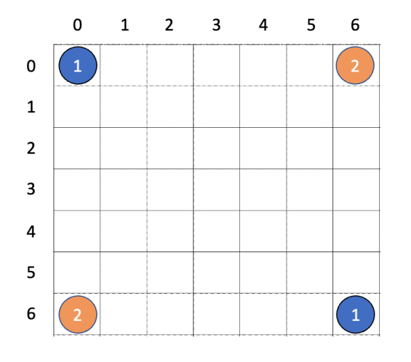

Initially, P1 starts with two pieces at (0,0) and (6,6), while P2 starts with two pieces at (0,6) and (6,0). Players take turns to take either of the following actions:

- **Clone**: Move a piece to an empty adjacent (8-neighbor) cell. The original piece remains in place and a new piece is created.
- **Jump**: Move a piece exactly 2 squares away, but only vertically or horizontally. The original piece is relocated.

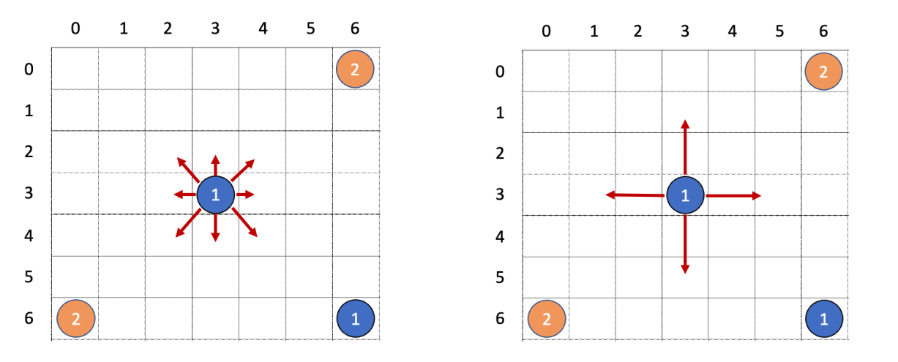

The capture mechanism: After each move, all opponent pieces in the surrounding 8-neighborhood of the destination cell are converted to the current player's pieces.

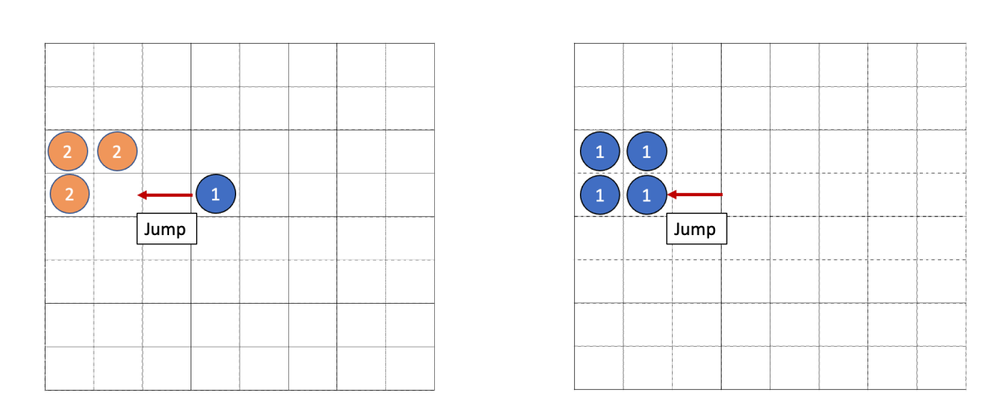

The game terminates when any of the following conditions are met:

1. Board is full.
2. A player has no pieces left. The opponent wins.
3. The number of moves reaches 200.

If the game ends due to the board being full or reaching the move limit, the player with more pieces on the board wins. 

In this report, we will discuss the implementation of an Ataxx agent using various search algorithms and heuristics, and evaluate the performance of different strategies.

## 2. Search Framework

### 2.1. Minimax Search

The search space can be represented as a tree where each node corresponds to a game state, and edges represent possible moves. 

The Minimax algorithm is used to explore this tree, where the maximizing player (our agent) tries to maximize the advantage, and the minimizing player (the opponent) tries to minimize it. The root node is a max node (our turn), and the child nodes alternate between min and max nodes.

The following image illustrates the idea of the Minimax algorithm (where green nodes are max nodes and red nodes are min nodes).

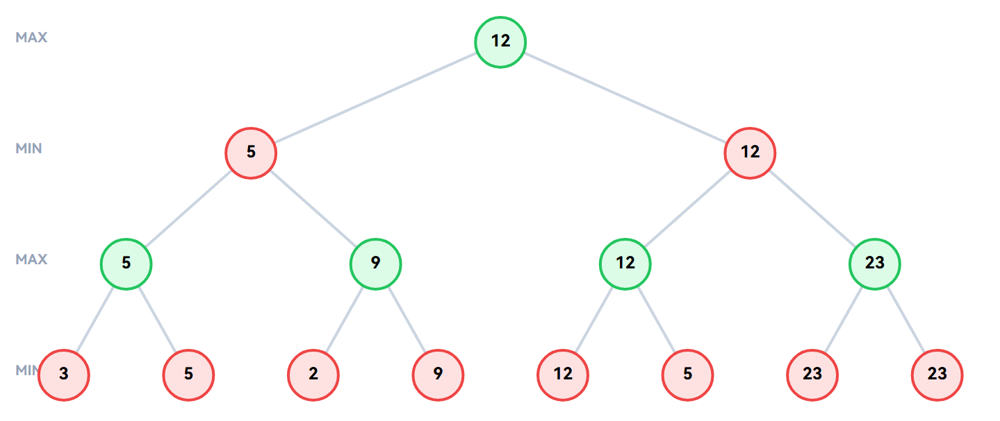

Consider the complexity of the search space. The branching factor (number of possible moves) can be quite large, and the maximum branching factor is at least 128 (when P1 has 16 pieces and each can move to 8 adjacent cells). The depth of the search tree can be up to 200 (the move limit). Therefore, the time complexity of a naive Minimax search is $O(b^d)$, where $b$ is the branching factor and $d$ is the depth of the tree. It is computationally infeasible to search the entire tree, so optimizations such as alpha-beta pruning and heuristic evaluation are necessary.

For heuristic evaluation, a maximum search depth `maxDepth` is given. If the search reaches this depth, the game state is evaluated using a heuristic function. The heuristic function first check for terminal states (win/loss), and if the game is not terminal, it estimates the advantage of the current player based on various factors that are going to be discussed in Section 4.

Mathematically, the Minimax value of a node can be defined as follows:

$$
V(s, d, \text{maximizing}) =
\begin{cases}
\text{Heuristic}(s) & \text{if } d = \text{maxDepth} \\
\max_{a \in \text{Actions}(s)} V(\text{Result}(s, a), d+1, \text{False}) & \text{if maximizing} \\
\min_{a \in \text{Actions}(s)} V(\text{Result}(s, a), d+1, \text{True}) & \text{if not maximizing}
\end{cases}
$$

### 2.2. Alpha-Beta Negamax

Alpha-beta pruning is an optimization technique for the Minimax algorithm that reduces the number of nodes evaluated in the search tree. It uses two values, $\alpha$ and $\beta$, to keep track of the best scores for both players.

Negamax is a variant of Minimax that simplifies the implementation by treating both players symmetrically. Due to the zero-sum nature of the game, given a game state, the value for the maximizing player can be represented as the negative of the value for the minimizing player. Therefore, during the recursive calls, the returned value is negated to switch perspectives.

The following image illustrates the idea of the Alpha-beta Negamax algorithm (where $[\alpha, \beta]$ represents the current bounds for pruning, and gray nodes are pruned).

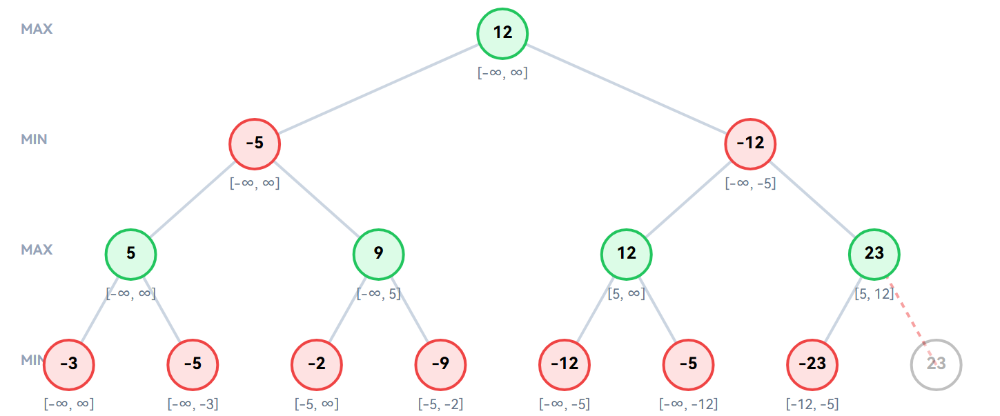

The alpha-beta negamax algorithm can be defined as follows:

$$
V(s, d, \alpha, \beta) =
\begin{cases}
\text{Heuristic}(s) & \text{if } d = \text{maxDepth} \\
\max_{a \in \text{Actions}(s)} (-V(\text{Result}(s, a), d+1, -\beta, -\alpha)) & \text{otherwise}
\end{cases}
$$

In Alpha-beta Negamax, a beta cut-off occurs when the value of a node is greater than or equal to $\beta$, which means that the opponent will avoid this branch, because a better move for them has already been found. If a move is not pruned but greater than $\alpha$, $\alpha$ is updated to this new value. Finally, the algorithm returns the $\alpha$ value, which represents the best score for the current player.

Alpha-beta Negamax efficiently reduces the number of nodes evaluated, but it still requires a maximum search depth to be set, and the performance can vary greatly depending on the branching factor and the quality of the heuristic evaluation.

### 2.3. Iterative Deepening

To maximize the search depth within a time limit, the iterative deepening technique is used. This approach performs a depth-limited search repeatedly, increasing the depth limit with each iteration until the time limit is reached.

Specifically, the Alpha-beta Negamax search is first called with a depth limit of 1. If the search completes within the time limit, the depth limit is increased by 1, and the search is performed again. This process continues until the time limit is exceeded. The best move found in the last completed search is returned as the final move.

The advantage of iterative deepening is that it allows the agent to find a reasonable move even if the time limit is reached before the maximum depth is fully explored. It also helps to improve move ordering, where the best moves found in earlier iterations can be prioritized in later iterations, increasing the chances of pruning in the alpha-beta search. With advanced move ordering techniques (which will be discussed in Section 3), the search can be significantly more efficient, allowing to reach deeper levels compared to a fixed-depth search in the same time limit.

### 2.4. Monte Carlo Tree Search (MCTS)

In addition to knowledge-based search algorithms, the Monte Carlo Tree Search (MCTS) algorithm is also implemented. It is a stochastic search method that builds a search tree based on random simulations of the game. MCTS consists of four main steps: selection, expansion, simulation, and backpropagation.

1. **Selection**: Starting from the root node, the algorithm selects the best child node at each level based on a selection policy (UCT) until it reaches a leaf node.
2. **Expansion**: If the leaf node is not a terminal state, one of the possible moves is added as a child node.
3. **Simulation**: Simulate a random playout from the new child node until a terminal state is reached, and determine the winner.
4. **Backpropagation**: Update the statistics (win/visit counts) of the nodes along the path from the new child node back to the root based on the simulation result.

The UCT (Upper Confidence Bound for Trees) selection policy is defined as follows:

$$
\text{UCT}(s, a) = \frac{w(s, a)}{n(s, a)} + K \sqrt{\frac{\log N(s)}{n(s, a)}}
$$

Where:

- $w(s, a)$ is the number of wins for action $a$ from state $s$.
- $n(s, a)$ is the number of visits for action $a$ from state $s$.
- $N(s)$ is the total number of visits for state $s$.
- $K = \sqrt{2}$ is the exploration constant.

The UCT formula balances exploration (choosing less visited nodes) and exploitation (choosing nodes with higher win rates). MCTS can be particularly effective in games with large branching factors and less predictable outcomes, and does not require any prior knowledge about the game.

## 3. Optimization Techniques

Several optimization techniques are necessary to increase the efficiency of the search algorithms. They either reduce the constant factors in the time complexity or reduce the number of nodes explored.

### 3.1. Bitboard Representation

A bitboard representation compresses the game state into bit strings. For this game, two 64-bit integers are used to represent the positions of P1 and P2 pieces on the 7x7 board, respectively.

The board coordinate $(r, c)$ is mapped to the bit index $i$ in the bitboard as follows: $i = 8 \cdot r + c$. For example, the initial position of P1 with pieces at (0,0) and (6,6) can be represented as a bitboard where 0 and 48 bits are set to 1, and the rest are 0.

Bitboard representation allows for several further optimizations:

- During recursive calls, instead of creating new arrays for the game state, we can simply pass the bitboards by value. This is both memory efficient and faster.
- Lowbit can be used to iterate through the pieces of a player efficiently. For example, to find all pieces of P1, we can use a loop that repeatedly extracts the least significant bit (LSB) from the bitboard until it becomes zero.

```cpp
inline int lsb_index(U64 x) {
    return __builtin_ctzll(x);
}

BitBoard s; // current game state
U64 t = s.p1;
while (t) {
    int idx = lsb_index(t);
    t &= t - 1; // remove the LSB
    // process the piece at index idx
}
```

- Popcount can be used to count the number of pieces for a player efficiently.

```cpp
inline int popcount(U64 x) {
    return __builtin_popcountll(x);
}

BitBoard s; // current game state
int p1_count = popcount(s.p1);
```

### 3.2. Precomputed Masks

To check for valid positions and moves efficiently, the following precomputed masks are used:

- `g_valid_mask`: The mask with bits set to 1 for valid board positions (0 to 6, 8 to 14, ..., 48 to 54).
- `g_adj_mask`: A list of masks for each position that indicate the 8-neighbor cells for capture and clone moves.
- `g_jump_dst_mask`: A list of masks for each position that indicate the valid jump destinations.

When used, bitwise ANDed with the bitboard to quickly determine valid positions and moves:

- Clone targets: `g_adj_mask[idx] & empty_cells`
- Jump targets: `g_jump_dst_mask[idx] & empty_cells`
- Converted pieces after a move: `g_adj_mask[dst_idx] & opponent_pieces`

This simplifies the capture logic:

```cpp
U64 flip = g_adj_mask[didx] & (player == 1 ? ns.p2 : ns.p1);
if (player == 1) {
  ns.p2 &= ~flip;
  ns.p1 |= flip;
} else {
  ns.p1 &= ~flip;
  ns.p2 |= flip;
}
```

### 3.3. Zobrist Hashing and Transposition Table

Zobrist hashing is a technique to generate a unique hash value for each game state. It uses a precomputed random number for each possible piece and position, and the hash value for any state can be computed by XORing the corresponding random numbers for the piece-position combinations.

In Ataxx, a total of $NM = 49$ positions and 2 piece types (P1 and P2) result in $2 \cdot NM = 98$ random numbers in `g_zob`. In addition, `g_zob_side` is used to indicate which player's turn it is; because even if the positions are the same, the game state is different when it's P1's turn versus P2's turn. After a move is made, `g_zob_side` is XORed to the hash value to reflect the change in the player's turn; due to the properties of XOR that $A \oplus \text{g\_zob\_side} \oplus \text{g\_zob\_side} = A$, when it is applied again and P1's turn is back, the hash value will be the same as before.

Zobrist hashing allows for incremental updates to the hash value when a move is made, which is much faster than recomputing the hash. When a move is made, find the pieces that have changed (created, removed, or converted) and XOR the corresponding random numbers to update the hash value.

```cpp
inline U64 incremental_hash(U64 old_hash, const Bitboard& old_s, const Bitboard& new_s) {
    U64 h = old_hash ^ g_zob_side;

    U64 p1_diff = old_s.p1 ^ new_s.p1;
    while (p1_diff) {
        int idx = lsb_index(p1_diff);
        p1_diff &= (p1_diff - 1);
        h ^= g_zob[idx][1];
    }

    U64 p2_diff = old_s.p2 ^ new_s.p2;
    while (p2_diff) {
        int idx = lsb_index(p2_diff);
        p2_diff &= (p2_diff - 1);
        h ^= g_zob[idx][2];
    }

    return h;
}
```

Zobrist hashing also enables efficient storage and retrieval of game states in a transposition table, which is a hash table that stores previously evaluated game states and their corresponding heuristic values. When the search algorithm encounters a game state, it can check the transposition table to see if the state has already been evaluated. If it has, the stored heuristic value can be used directly. As there are often multiple paths to reach the same game state, this can significantly reduce the number of nodes evaluated.

The TT entry contains the following information:

- `key`: The full 64-bit hash value of the game state.
- `score`: The heuristic evaluation score of the game state.
- `depth`: The remaining depth of the search (`maxDepth - d`) when the state was evaluated.
- `flag`: Indicates whether the stored score is an exact value, a lower bound, or an upper bound.
- `valid`: A boolean indicating whether the entry is valid, initialized to false.
- `best`: The best move found from this state.

When storing an entry in the transposition table, only the last 19 bits of the hash value are used as the index, and the full 64-bit hash is stored in the `key` field to handle collisions: 

- When retrieving an entry, only if the entry is valid and the stored key matches the current hash value, the entry is considered a hit and returned.
- When storing an entry, it will replace the existing entry if it is invalid, or if it happens to have the same key, or if it has a shallower remaining depth than the new entry. This way, deeper evaluations are prioritized in the transposition table.

```cpp
inline TTEntry* tt_probe(U64 key) {
    TTEntry* e = &g_tt[key & TT_MASK];
    if (e->valid && e->key == key) return e;
    return nullptr;
}

inline void tt_store(U64 key, int8 depth, int8 flag, int score, const Move& best) {
    TTEntry& e = g_tt[key & TT_MASK];
    if (!e.valid || e.key == key || e.depth <= depth) {
        e.valid = 1;
        e.key = key;
        e.depth = depth;
        e.flag = flag;
        e.score = score;
        e.best = best;
    }
}
```

### 3.4. Move Ordering Heuristic (Killer Moves)

As previously mentioned, the efficiency of alpha-beta pruning can be significantly improved by ordering the moves such that the best moves are evaluated first.

Killer moves [1] are moves that have caused a beta cut-off in the past at the same depth. The idea is that if a move has previously caused a cut-off, it is likely to be a good move in similar positions, and should be tried early in the move ordering. 

At each depth, the two most recent killer moves are stored in a `killer` array. When a beta cut-off occurs, the move that caused the cut-off is stored as the first killer move for that depth, and the previous first killer move (if any) is moved to the second slot.

The following image illustrates the concept of killer moves:

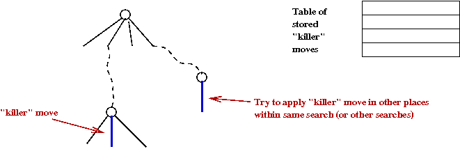

The following move ordering is used when generating moves for a given game state:

1. TT best move
2. `killer[depth][0]`
3. `killer[depth][1]`
4. Other moves

For other moves, the following heuristic is used to assign a priority score:

$$
V(mv) = w_b + \text{cap} \cdot w_c - \text{dist}((3, 3), (dr, dc))
$$

Where:

- `w_b` is 120 for clone moves and 100 for jump moves, as clone moves are generally more advantageous.
- `w_c` is the weight for captures, `cap` is the number of opponent pieces that would be captured by this move.
- `dist((3, 3), (dr, dc))` is the Euclidean distance from the destination cell to the center of the board, which encourages moves towards the center.

```cpp
int g_clone_base_pri = 120;
int g_capture_weight = 35;
const int g_jump_base_pri = 100;

void generate_moves(const Bitboard& s, int8 player, vector<Move>& moves, bool any_one = false) {
    // Generate all valid moves for the given player. If any_one is true, return the first valid move found.
    moves.clear();
    U64 me = (player == 1 ? s.p1 : s.p2);
    U64 occ = s.p1 | s.p2;
    U64 empty = g_valid_mask & (~occ);

    while (me) {
        int idx = lsb_index(me);
        me &= (me - 1);
        int sr = idx / 8;
        int sc = idx % 8;

        U64 clone_targets = g_clone_dst_mask[idx] & empty;
        while (clone_targets) {
            int didx = lsb_index(clone_targets);
            clone_targets &= (clone_targets - 1);
            int dr = didx / 8;
            int dc = didx % 8;
            Move mv(sr, sc, dr, dc, 1);

            U64 cap_mask = g_adj_mask[didx] & (player == 1 ? s.p2 : s.p1);
            int cap = popcnt(cap_mask);
            mv.pri = g_clone_base_pri + cap * g_capture_weight - center_dist2(dr, dc);
            moves.push_back(mv);
            if (any_one) return;
        }

        U64 jump_targets = g_jump_dst_mask[idx] & empty;
        while (jump_targets) {
            int didx = lsb_index(jump_targets);
            jump_targets &= (jump_targets - 1);
            int dr = didx / 8;
            int dc = didx % 8;
            Move mv(sr, sc, dr, dc, 0);

            U64 cap_mask = g_adj_mask[didx] & (player == 1 ? s.p2 : s.p1);
            int cap = popcnt(cap_mask);
            mv.pri = g_jump_base_pri + cap * g_capture_weight - center_dist2(dr, dc);
            moves.push_back(mv);
            if (any_one) return;
        }
    }
}
```

## 4. Heuristic

Choosing an effective heuristic evaluation function is crucial for the performance of the agent.

All the heuristics below are the difference between the current player and the opponent. For simplicity, the discussed formula will be for P1, and the value for P2 can be calculated symmetrically. The final heuristic value will be the value for P1 minus the value for P2.

### 4.1. Material

The most straightforward heuristic is to count the number of pieces for each player. The player with more pieces on the board is generally in a better position. For each piece of P1:

$$
f = 1
$$

The resulting heuristic value is the number of pieces of P1 minus the number of pieces of P2:

$$
F = \#P1 - \#P2
$$

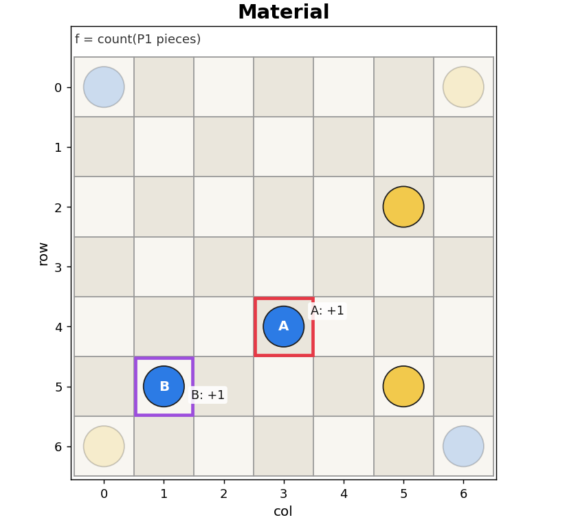

### 4.2. Mobility

Mobility counts the number of valid moves available to the player. For each piece of P1:

$$
f = \#\text{clone moves} + \#\text{jump moves}
$$

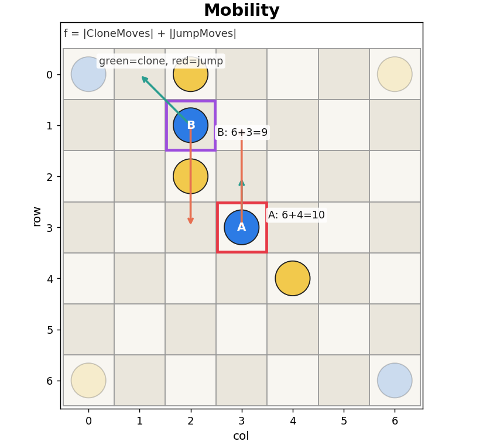

### 4.3. Center Control

Controlling the center of the board is often advantageous, as it allows for more mobility and better capture opportunities. For each piece of P1:

$$
f = 50 - 4 \cdot \text{dist}_{L2}^2((3, 3), (r, c))
$$

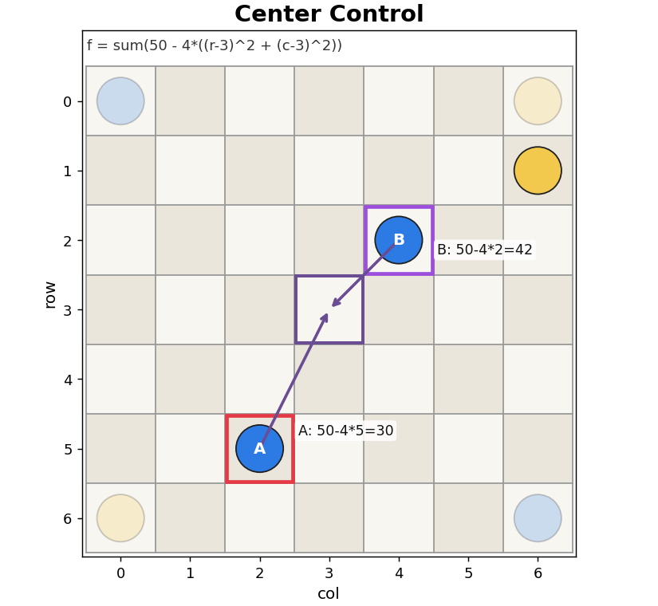

### 4.4. Potential Conversion

Potential conversion only cares about the number of opponent pieces that can be captured in the next turn. For each piece of P1:

$$
f = 25 \cdot \#\text{opponent adjacent}
$$

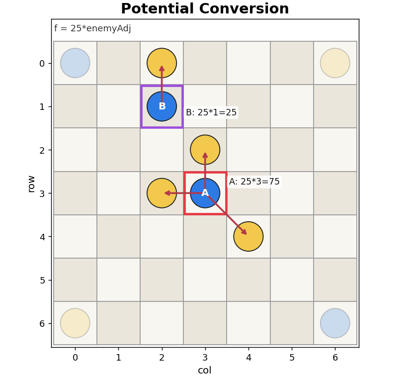

### 4.5. Infection Pressure

Infection pressure counts both the number of opponent pieces and the number of friendly pieces in the 8-neighborhood of each piece. Enemy pieces provide more capture opportunities, while friendly pieces provide more support and chances for follow-up moves. For each piece of P1:

$$
f = 12 \cdot \#\text{opponent adjacent} + 4 \cdot \#\text{friendly adjacent}
$$

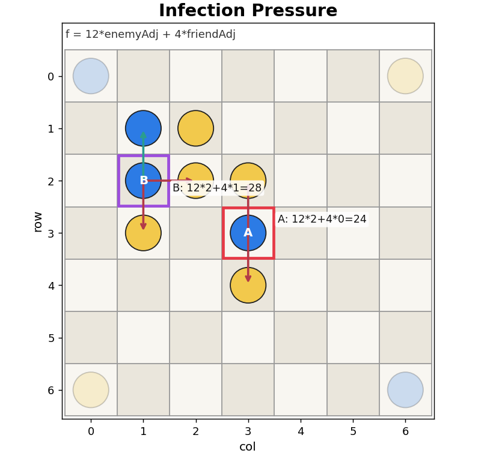

### 4.6. Expansion

Expansion is Mobility but weighted, giving higher scores to clone moves as they create new pieces and thus have more long-term potential. For each piece of P1:

$$
f = 6 \cdot \#\text{clone moves} + 3 \cdot \#\text{jump moves}
$$

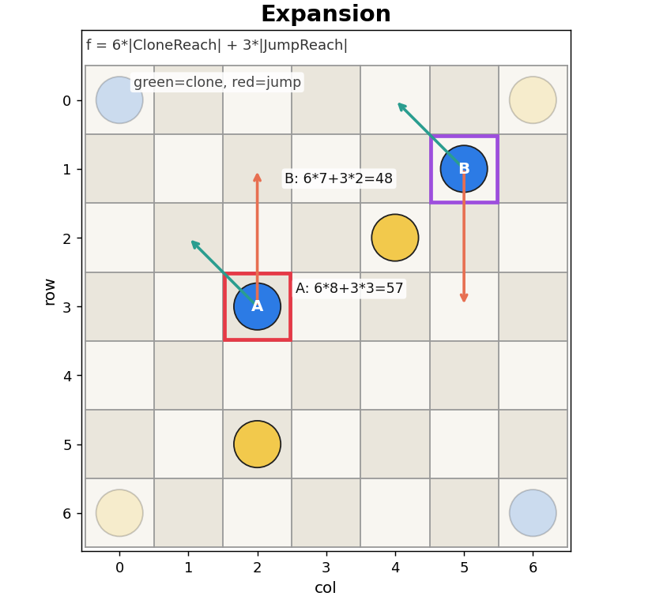

### 4.7. Safety

Different from Infection pressure which is an offensive heuristic, Safety negatively weights the number of opponent pieces in the 8-neighborhood, as they pose a threat to be captured in the next turn. For each piece of P1:

$$
f = 6 \cdot \#\text{friendly adjacent} - 8 \cdot \#\text{opponent adjacent}
$$

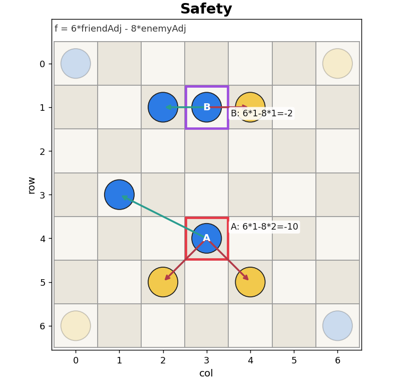

### 4.8. Influence

Influence is a global (not piece-wise) heuristic that considers the level of control and threat for each cell on the board. For each empty cell, it contributes to the player who has more pieces in its 8-neighborhood; the score for that cell is:

$$
g = 9 \cdot (\#P1 {\text{adjacent}} - \#P2 {\text{adjacent}})
$$

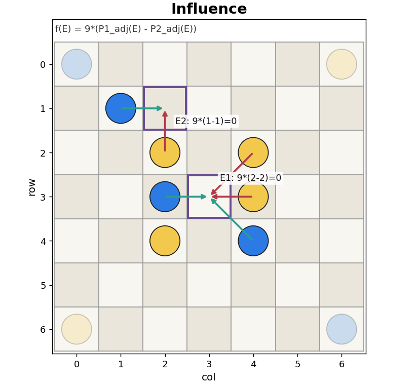

### 4.9. Frontier

Frontier counts the number of pieces that are adjacent to at least one empty cell, and provide an early-game bonus and a late-game penalty (the game status is estimated by the total number of pieces on the board. If less than 33, it is early game; otherwise, it is late game).

$$
f = \begin{cases}
6 & \text{if early game} \\
-6 & \text{if late game}
\end{cases}
$$

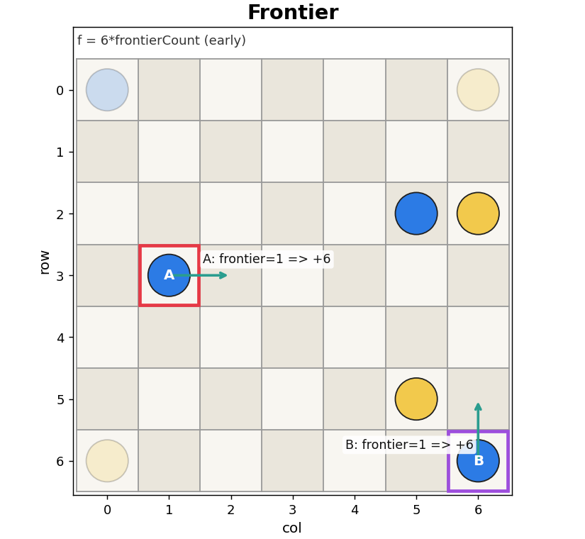

### 4.10. Position Weight

A 7x7 table of position weights is used to encourage occupying more advantageous positions on the board.

```cpp
const int PositionWeightHeuristic::pos_weight[7][7] = {
    {90, -20, 10, 5, 10, -20, 90},
    {-20, -50, -5, 0, -5, -50, -20},
    {10, -5, 20, 15, 20, -5, 10},
    {5, 0, 15, 30, 15, 0, 5},
    {10, -5, 20, 15, 20, -5, 10},
    {-20, -50, -5, 0, -5, -50, -20},
    {90, -20, 10, 5, 10, -20, 90}
};
```

The values are determined after experimenting with previous heuristics and observing the game states. The corners are given the highest weight as they are the safest positions, while the center is also valuable for its mobility and influence. The cells adjacent to the corners are heavily penalized as they are vulnerable to being captured, without good opportunities for extending or escaping.

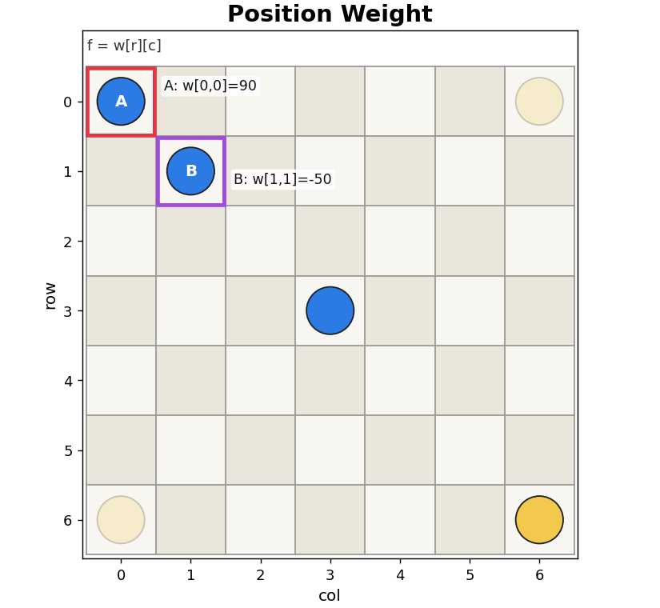

### 4.11. Control Area

Control area gives +32 if a piece could move to a 8-neighbor cell and +16 if a piece could jump next turn. This ring of control around a piece approximates the local influence of that piece, and prevents the agent to blocking itself by putting pieces too close to each other.

$$
f = 32 \cdot I_[d=1] + 16 \cdot I_[d=2]
$$

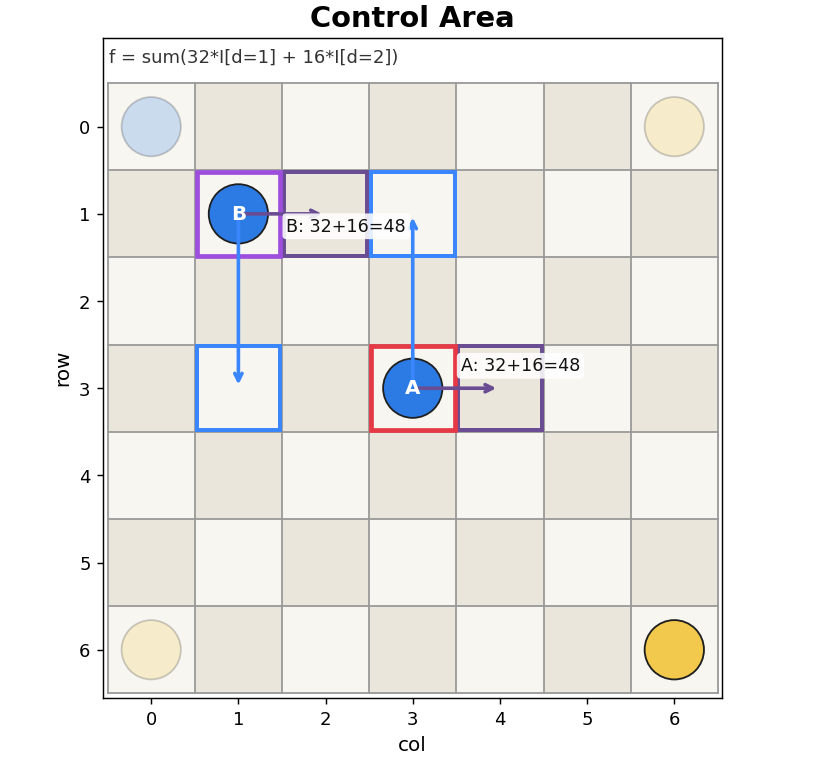

### 4.12. Aggression

Aggression awards pieces that are close to the opponent, as they have more chances to capture opponent pieces and thus gain a material advantage. For each piece of P1:

$$
f = 8 \cdot (12 - \text{dist}_{L1}((r, c), \text{nearest opponent}))
$$

Manhattan distance is used.

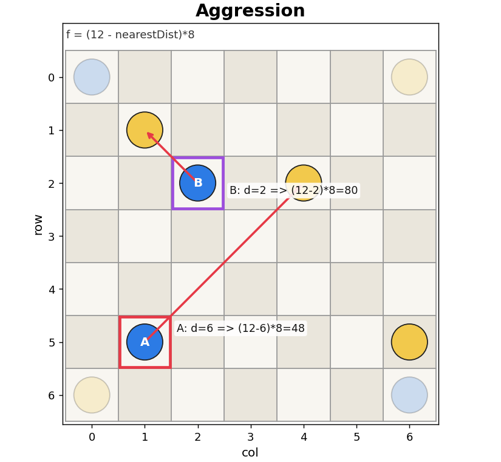

### 4.13. Hybrid

After preliminary testing the performance of each individual heuristic (to be discussed in Section 5), a hybrid heuristic is created by combining Center control, infection pressure and expansion.

$$
f = 40 - 3 \cdot \text{dist}_{L2}^2((3, 3), (r, c)) + 10 \cdot \#\text{opponent adjacent} + 4 \cdot \#\text{clone moves}
$$

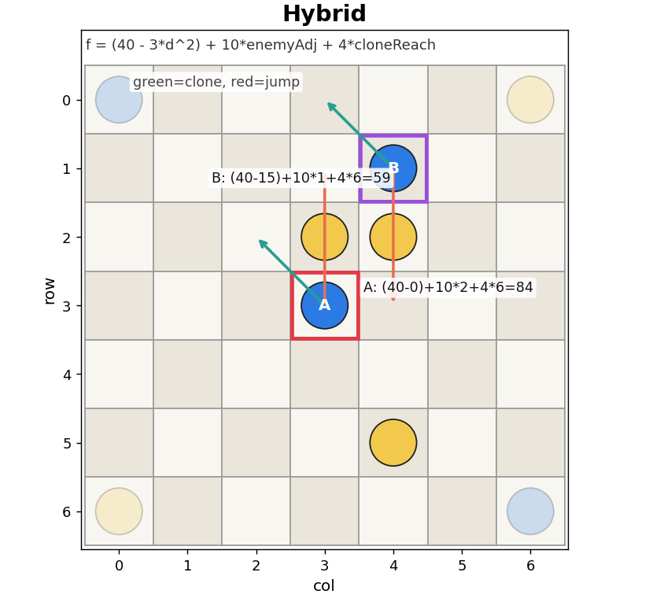

### 4.14. Combination of Heuristics

In addition to 13 base heuristics, two combinations of heuristics can be used:

- `MaterialBoostHeuristic(h, w_mat)`: a wrapper that adds `w_mat` times the Material heuristic to any given heuristic `h`. This is based on the observation that material advantage is the most fundamental aspect of the game, and can provide a solid foundation for other heuristics to build upon.
- `APlusBHeuristic(h1, h2, w1, w2)`: a wrapper that combines two heuristics `h1` and `h2` with weights `w1` and `w2`, respectively. This allows for more flexible combinations of heuristics to be tested.

## 5. Evaluation

### 5.1. Tournament Setup

To evaluate the performance of different heuristics and search algorithms, a tournament is conducted where each pair of heuristics is tested against each other. By default, each pair of heuristics is tested with 10 trial (half with A being P1 and half with A being P2), and the time limit for each move is set to 1000 ms. The results are ranked primarily by the number of wins, then by the number of timeout wins (winning after 200 moves, lower is better), and finally by the average move time (lower is better).

### 5.2. Evaluation of Search Algorithms

Table 1 shows the results of comparing Alpha-beta Negamax against Iterative Deepening using the same Heuristic.

| Rank | Heuristic | Wins | Timeout Wins | Avg Move Time |
|---:|---|---:|---:|---:|
| 1 | ID-Expansion+Mat40 | 28 | 5 | 805.85 |
| 2 | AB7-Expansion+Mat40 | 20 | 0 | 107.25 |
| 3 | AB6-Expansion+Mat40 | 7 | 2 | 22.54 |
| 4 | AB5-Expansion+Mat40 | 5 | 5 | 5.64 |

Conclusion: Iterative Deepening significantly outperforms fixed-depth Alpha-beta Negamax, as it can reach deeper levels in the search tree within the same time limit, and thus find better moves. The results also show that with the increase of search depth, the performance of Alpha-beta Negamax improves.

Table 2 shows the results of comparing MCTS against Iterative Deepening using the same Heuristic.

| Rank | Heuristic | Wins | Timeout Wins | Avg Move Time |
|---:|---|---:|---:|---:|
| 1 | ID-Hybrid | 30 | 0 | 42.06 |
| 2 | MCTS-Material | 15 | 0 | 945.05 |
| 3 | MCTS-Hybrid | 11 | 0 | 950.19 |
| 4 | MCTS | 4 | 0 | 979.98 |

Conclusion: for Ataxx, a deterministic perfect information game, the knowledge-based search algorithm (Iterative Deepening) significantly outperforms the knowledge-free search algorithm (MCTS). The results also show that MCTS with a reasonable heuristic (Material or Hybrid) performs much better than vanilla MCTS, though it still cannot competes with Iterative Deepening.

### 5.3. Evaluation of Heuristics

#### 5.3.1. Baseline Comparison

Table 3 shows the results of comparing different heuristics using Iterative Deepening. All heuristics expect Material are by default combined with 50 times the Material heuristic, as material advantage is the most fundamental aspect of the game and can provide a solid foundation for other heuristics to build upon.

It should be noted that while ID has a time limit of 1000 ms, the average move time can be much lower than 1000 ms, as the search may prune a lot of branches and find good moves early on, especially with the help of move ordering heuristics.

| Rank | Heuristic | Wins | Timeout Wins | Avg Move Time |
|---:|---|---:|---:|---:|
| 1 | Influence | 105 | 25 | 19.93 |
| 2 | Expansion | 90 | 50 | 16.11 |
| 3 | Material | 75 | 25 | 12.75 |
| 4 | PotentialConversion | 70 | 20 | 14.90 |
| 5 | Frontier | 70 | 20 | 16.14 |
| 6 | Mobility | 70 | 20 | 60.23 |
| 7 | PositionWeight | 70 | 35 | 13.82 |
| 8 | Hybrid | 65 | 20 | 25.36 |
| 9 | Aggression | 65 | 25 | 45.48 |
| 10 | Adaptive | 60 | 30 | 24.10 |
| 11 | ControlArea | 50 | 35 | 18.35 |
| 12 | CenterControl | 45 | 5 | 20.07 |
| 13 | InfectionPressure | 45 | 20 | 18.87 |
| 14 | Safety | 30 | 5 | 16.69 |

Conclusion: 

- Material is a solid heuristic as expected.
- Heuristics that consider the mobility and influence of pieces (Influence, Expansion, Potential Conversion) perform better than heuristics that only consider static features of the pieces (Position Weight, Center Control).

#### 5.3.2. Combination of Heuristics

For further improvement, different combinations of some of the better-performing heuristics (Influence, Expansion, Potential Conversion, Frontier) are tested against each other.

Table 4 shows the results of comparing different combinations of heuristics using Iterative Deepening. This experiment also compares the performance of these combinations with their individual components.

| Rank | Heuristic | Wins | Timeout Wins | Avg Move Time |
|---:|---|---:|---:|---:|
| 1 | Influence+PotentialConversionx1 | 70 | 25 | 22.14 |
| 2 | Influence | 60 | 20 | 17.79 |
| 3 | Influence+Expansionx1 | 60 | 25 | 17.82 |
| 4 | Expansion+PotentialConversionx1 | 50 | 10 | 18.69 |
| 5 | Influence+Frontierx1 | 50 | 10 | 20.20 |
| 6 | Frontier | 50 | 30 | 10.64 |
| 7 | PotentialConversion+Frontierx1 | 50 | 30 | 12.62 |
| 8 | Expansion+Frontierx1 | 40 | 10 | 19.05 |
| 9 | Expansion | 40 | 20 | 9.30 |
| 10 | Material | 40 | 30 | 8.29 |
| 11 | PotentialConversion | 40 | 30 | 9.93 |

Conclusion:

- Combining heuristics generally improves performance compared to using individual heuristics, as it allows the agent to consider multiple aspects of the game state simultaneously.
- The best-performing combination is Influence and Potential Conversion, which suggests that considering both the global influence of pieces and the immediate capture opportunities provides a strong evaluation of the game state.

### 5.3.3. Material Weight Tuning

Another important aspect of the heuristic design is the weight assigned to the Material heuristic. A weight too high may cause Material to dominate the evaluation, while a weight too low may cause the agent to overlook the fundamental importance of material advantage.

Table 5 shows the results of comparing different weights for the Material heuristic when combined with Expansion and Influence, which are two of the better-performing heuristics from previous experiments. The base Material weight is set to 50, so "+Mat40" means a total of 50+40=90 times the Material heuristic is added.

| Rank | Heuristic | Wins | Timeout Wins | Avg Move Time |
|---:|---|---:|---:|---:|
| 1 | Expansion+Mat40 | 55 | 15 | 18.13 |
| 2 | Influence+Mat80 | 45 | 15 | 18.80 |
| 3 | Expansion+Mat80 | 45 | 25 | 18.86 |
| 4 | Expansion+Mat0 | 40 | 15 | 14.49 |
| 5 | Influence+Mat40 | 35 | 15 | 17.52 |
| 6 | Influence+Mat0 | 30 | 15 | 17.76 |
| 7 | Expansion+Mat-40 | 15 | 10 | 9.97 |
| 8 | Influence+Mat-40 | 15 | 10 | 12.46 |

Conclusion: The Material weight has significant impact on the performance of the heuristic. Influence is stronger than Expansion in previous experiments, but with a suitable weight, Expansion (+Mat40) can outperform Influence (of any weight).

Table 6 shows the results of testing different search algorithms, heuristic combinations and Material weights together.

| Rank | Heuristic | Wins | Timeout Wins | Avg Move Time |
|---:|---|---:|---:|---:|
| 1 | ID-Influence+Expansionx1 | 101 | 9 | 806.52 |
| 2 | ID-Influence+PotentialConversionx1+Expansionx1 | 91 | 0 | 794.36 |
| 3 | ID-Influence+PotentialConversionx1 | 91 | 11 | 751.91 |
| 4 | ID-Expansion+Mat40 | 90 | 15 | 837.05 |
| 5 | ID-Frontier | 85 | 13 | 827.66 |
| 6 | ID-Material | 82 | 3 | 837.49 |
| 7 | ID-Influence+PotentialConversionx1+Mat-40 | 75 | 5 | 817.18 |
| 8 | AB7-Expansion+Mat40 | 50 | 5 | 84.39 |
| 9 | AB7-Influence+PotentialConversionx1 | 50 | 5 | 97.98 |
| 10 | AB7-Material | 50 | 15 | 37.34 |
| 11 | AB7-Influence+PotentialConversionx1+Expansionx1 | 45 | 5 | 134.70 |
| 12 | AB7-Frontier | 40 | 2 | 47.40 |
| 13 | AB7-Influence+Expansionx1 | 35 | 0 | 122.99 |
| 14 | AB7-Influence+PotentialConversionx1+Mat-40 | 25 | 0 | 147.42 |

Conclusion:

- Iterative Deepening overperforms Alpha-beta Negamax under all heuristic.
- Different combinations of heuristics may contribute to different levels of performance improvement, but the best-performing combination is still Influence and Expansion.

## 6. Further Improvements - Hyperparameter Tuning and Random Search

However, when competing against other students' models, the performance is not as good as expected. After analyzing the game records, it is found that the clone weight (initially set to 300) in move ordering is too high, which causes the agent to prioritize clone moves too much and overlook good jump moves. To resolve this issue, a thorough hyperparameter tuning is conducted for various weights.

### 6.1. Clone Weight Tuning

Table 7 shows the results of testing different clone weights for move ordering. (2 trials for each pair)

| Rank | Heuristic | Wins | Timeout Wins | Avg Move Time |
|---:|---|---:|---:|---:|
| 1 | ID-Expansion+Mat40-CloneBase60 | 10 | 2 | 847.02 |
| 2 | ID-Expansion+Mat40-CloneBase100 | 5 | 1 | 850.82 |
| 3 | ID-Expansion+Mat40-CloneBase250 | 4 | 0 | 706.23 |
| 4 | ID-Expansion+Mat40-CloneBase200 | 4 | 0 | 806.32 |
| 5 | ID-Expansion+Mat40-CloneBase150 | 4 | 0 | 885.73 |
| 6 | ID-Expansion+Mat40-CloneBase300 | 3 | 0 | 876.63 |

Conclusion: Reducing the clone weight from 300 to 60 significantly improves the performance of the agent, as it allows the agent to consider jump moves more seriously, which can be crucial in certain game states.

### 6.2. Random Search for Hyperparameters

To efficiently find good hyperparameters, a random search is conducted for the following parameters:

- Clone base weight (between 20 and 180)
- Capture weight (between 10 and 50)
- Material weight (between 20 and 100), with the base Material weight set to 0

Table 8 shows the results of the random search (6 trials for each pair). For example, `Expansion_Cl120_Ca35_M80` means the clone base weight is 120, the capture weight is 35 and the material weight is 80.

| Rank | Heuristic | Wins | Timeout Wins | Avg Move Time |
|---:|---|---:|---:|---:|
| 1 | Expansion_Cl120_Ca35_M80 | 73 | 24 | 739.81 |
| 2 | Expansion_Cl120_Ca10_M30 | 70 | 15 | 796.12 |
| 3 | Expansion_Cl170_Ca15_M40 | 69 | 16 | 763.71 |
| 4 | Expansion_Cl150_Ca50_M60 | 68 | 9 | 794.75 |
| 5 | Expansion_Cl160_Ca50_M90 | 66 | 20 | 850.65 |
| 6 | Expansion_Cl100_Ca25_M80 | 65 | 17 | 814.82 |
| 7 | Expansion_Cl90_Ca40_M70 | 61 | 17 | 869.31 |
| 8 | Expansion_Cl90_Ca45_M80 | 53 | 14 | 915.12 |
| 9 | Expansion_Cl70_Ca40_M100 | 52 | 6 | 844.84 |
| 10 | Expansion_Cl70_Ca30_M80 | 51 | 12 | 889.88 |
| 11 | Expansion_Cl30_Ca50_M50 | 50 | 0 | 826.74 |
| 12 | Expansion_Cl170_Ca30_M100 | 50 | 18 | 801.43 |
| 13 | Expansion_Cl50_Ca20_M40 | 49 | 5 | 861.89 |
| 14 | Expansion_Cl150_Ca25_M100 | 49 | 19 | 849.88 |
| 15 | Influence+Expanison_Cl300_Ca30_M60 | 48 | 12 | 716.64 |
| 16 | Expansion_Cl60_Ca30_M70 | 48 | 13 | 874.31 |
| 17 | Expansion_Cl30_Ca10_M60 | 46 | 18 | 923.30 |
| 18 | Expansion_Cl90_Ca30_M30 | 43 | 0 | 849.66 |
| 19 | Influence+Expansion_Cl60_Ca30_M60 | 15 | 0 | 786.13 |

`Expansion_Cl60_Ca30_M70`, `Influence+Expansion_Cl60_Ca30_M60` and `Influence+Expanison_Cl300_Ca30_M60` corresponds to previously tested best-performing models in Table 6 and Table 7.

Conclusion: 

- The random search allows for efficient exploration of the hyperparameter space, and can lead to significant performance improvements compared to manually tuning each parameter. 
- The best-performing model from the random search is `Expansion_Cl120_Ca35_M80`, which suggests that a moderate clone weight (similar to the jump weight of 100) and a reasonably high material weight (80, compared to previous baseline of 50) can provide a good balance for move ordering and heuristic evaluation.

### 6.3. Final Model

Table 9 shows the results of evaluating the better-performing base heuristics under the same hyperparameters (Clone base weight = 120, Capture weight = 35, Material weight = 80) found from the random search.

| Rank | Heuristic | Wins | Timeout Wins | Avg Move Time |
|---:|---|---:|---:|---:|
| 1 | PositionWeight | 50 | 4 | 768.70 |
| 2 | Influence | 35 | 5 | 744.80 |
| 3 | PotentialConversion | 30 | 0 | 840.14 |
| 4 | Material | 30 | 0 | 878.56 |
| 5 | Mobility | 29 | 10 | 798.48 |
| 6 | Expansion | 26 | 5 | 763.25 |
| 7 | Frontier | 10 | 10 | 786.39 |

Table 10 shows the results of evaluating the combinations of better-performing base heuristics under the same hyperparameters.

| Rank | Heuristic | Wins | Timeout Wins | Avg Move Time |
|---:|---|---:|---:|---:|
| 1 | PositionWeight | 58 | 14 | 742.95 |
| 2 | Influence | 55 | 20 | 769.96 |
| 3 | Combo(PositionWeight+PotentialConversion) | 54 | 15 | 791.76 |
| 4 | Combo(PotentialConversion+Mobility) | 50 | 10 | 716.96 |
| 5 | Combo(Influence+PotentialConversion) | 46 | 8 | 754.67 |
| 6 | PotentialConversion | 45 | 20 | 845.59 |
| 7 | Combo(PositionWeight+Influence) | 40 | 5 | 753.73 |
| 8 | Mobility | 40 | 10 | 770.68 |
| 9 | Combo(Influence+Mobility) | 32 | 7 | 760.28 |
| 10 | Combo(PositionWeight+Mobility) | 30 | 0 | 764.07 |

However, the tournament has its limitations as it only tests against a limited set of opponents, and the results may not generalize well to other opponents which may have various play styles. After thorough testing against more opponents, it is found that Position Weight is less flexible and adaptable than Influence, but serves as a strong static evaluation when combined with other heuristics. Another aspect worth considering is the risk of timeouts; heuristics with more timeout wins have more unstable performance, as they may fail to find good moves within the time limit in certain game states. Therefore, the final model is `PotentialConversion+Mobility` with the hyperparameters found from the random search.

## 7. Conclusion

The final model is an Iterative Deepening search algorithm with a combination of base heuristics, achieving a strong performance against AIs and human players.

The main limitation of the current model is that it still relies on hand-crafted heuristics, which may not capture all the complexities of the game. Future work could explore the use of reinforcement learning to automatically learn heuristics from self-play, which has been successful in other board games like Go and Chess. That being said, the current heuristic-based model is still a competitive choice with limited time and computational resources. In addition, according to related papers on Ataxx, "Performance of Monte Carlo Tree Search Algorithms when Playing the Game Ataxx" [2] and "Generalized Proof-Number Monte-Carlo Tree Search
" [3], MCTS can perform well in Ataxx when tuned properly, so further improvements can be made by optimizing the MCTS implementation and its heuristics.

In summary, this project demonstrates the importance of search algorithms, heuristics, and hyperparameter tuning in designing a strong game-playing agent for Ataxx. My personal takeaways from this project include understanding the trade-offs between time and search depth, the significance of hyperparameter tuning via random search, and the value of systematic evaluation of different models and heuristics. 

The concept of systematic evaluation can be applied to other domains as well, such as machine learning, where controlled experiments and ablation studies are crucial for understanding the impact of anything from model architecture to training techniques.

## References and Acknowledgements

S. G. Akl and M. M. Newborn, “The principal continuation and the killer heuristic,” 1977 ACM Annual Conference Proceedings, pp. 466–473, Jan. 1977, doi: 10.1145/800179.810240. L. F. R. Ribeiro and D. R. Figueiredo, “Performance of Monte Carlo Tree Search Algorithms when Playing the Game Ataxx,” ENIAC 2018, pp. 275–286, Oct. 2018, doi: 10.5753/eniac.2018.4423. J. Kowalski, D. J. N. J. Soemers, S. Kosakowski, and M. H. M. Winands, “Generalized Proof-Number Monte-Carlo Tree Search,” in Frontiers in artificial intelligence and applications, 2025. doi: 10.3233/faia251406.

The code is completely original and implemented by myself, with reference to the lecture slides and some online resources for basic algorithms, while the heuristics and the overall design of the agent are my own.
