# Assignment 1 - Breakthrough Report
## 1. Introduction

Breakthrough is a two-player strategy board game. In this project, the game is played on a 8x8 board. Each player has 16 pieces, initially placed on the first two rows on both sides of the board (rows 0 and 1 for player 1, rows 6 and 7 for player 2).

During each turn, a player can move one of their pieces in two ways: (1) move it one square forward, either straight or diagonally, or (2) capture an opponent's piece by moving one square diagonally forward. The objective of the game is to move one of your pieces to the opponent's back row (row 7 for player 1, row 0 for player 2) or to capture all of the opponent's pieces.

In this report, we will discuss the implementation of a Breakthrough bot using different search algorithms, including Minimax, Iterative Deepening Search (IDS) and Monte Carlo Tree Search (MCTS).

## 2. Basic Search Frameworks

### 2.1. Minimax Algorithm

The implementation of the bot starts with the basic Minimax algorithm. The game is represented as a tree where each node corresponds to a game state, and edges represent possible moves. 

The root node is a max node, representing our turn, and the child nodes alternate between min and max nodes, representing the opponent's turn and our turn respectively.

The following image illustrates the idea of Minimax (green = max node, red = min node):


Considering the search space of Breakthrough. During each step, there can be at most $O(Pd)$ possible moves, where $P=16$ is the number of pieces and $d=3$ is the number of possible moves for each piece (forward, diagonal left, diagonal right). Therefore, the branching factor is at most 48. The depth of the search tree is the number of maximum possible turns, which is at most $O(N(M-2+M-1)+1) = O(NM)$, where $M=8$ is the number of rows and $N=8$ is the number of columns. Therefore, the time complexity of the Minimax algorithm is $O((Pd)^{NM})$, which is exponential and infeasible even for $8 \times 8$ board.

Therefore, we need to limit the depth of the search to `maxDepth` to make it feasible, and choose a heuristic evaluation function `h` to evaluate the game states at the leaf nodes of the search tree. Discussions about function `h` will be in the next section; now we just assume it represents player 1's advantage, and the higher the value, the better for player 1.

The following code implements Minimax:

```cpp
int minimax(BoardState b, int depth, int maxDepth, int player, Heuristic* h) {
    if (depth == maxDepth || check_win(b) != 0) {
        return h->evaluate(b, player);
    }

    vector<Move> moves = get_all_moves(b, player);
    if (moves.empty()) {
        return h->evaluate(b, player);
    }

    if (player == 1) { // Max node
        int bestScore = MY_NEG_INF;
        for (const Move& mv : moves) {
            BoardState new_b = apply_move(b, mv);
            int score = minimax(new_b, depth + 1, maxDepth, 2, h);
            bestScore = max(bestScore, score);
        }
        return bestScore;
    } else { // Min node
        int bestScore = MY_POS_INF;
        for (const Move& mv : moves) {
            BoardState new_b = apply_move(b, mv);
            int score = minimax(new_b, depth + 1, maxDepth, 1, h);
            bestScore = min(bestScore, score);
        }
        return bestScore;
    }
}

Move minimax_solver(BoardState b, int maxDepth, int player, Heuristic* h) {
    vector<Move> moves = get_all_moves(b, player);
    Move best_move = moves[0];
    int best_score = MY_NEG_INF;

    for (const Move& mv : moves) {
        BoardState new_b = apply_move(b, mv);
        int score = minimax(new_b, 1, maxDepth, 3 - player, h);
        if (score > best_score) {
            best_score = score;
            best_move = mv;
        }
    }
    return best_move;
}
```

### 2.2. Negamax with Alpha-Beta Pruning

Alpha-Beta pruning is an optimization technique for the Minimax algorithm that reduces the number of nodes evaluated in the search tree. It uses two values, alpha and beta, to keep track of the best scores for both players. 

Negamax is a variant of Minimax that simplifies the implementation using the principle of zero-sum games, where the advantage for player 1 is the loss for player 2 and vice versa.

Using Negamax with Alpha-Beta pruning, we maintain alpha and beta values to prune branches of the search tree that won't affect the final decision. If a branch is found that leads to a score better than the current beta for the min node, we can perform beta cut-off.

The following image illustrates the idea. The input is same as above, but dashed lines represent pruned branches:


The following code implements Negamax with Alpha-Beta Pruning:

```cpp
int abNegamax(BoardState b, int depth, int maxDepth, int player, Heuristic* h, int alpha, int beta) {
    if (depth == maxDepth || check_win(b) != 0) {
        return h->evaluate(b, player);
    }

    vector<Move> moves = get_all_moves(b, player);
    if (moves.empty()) {
        return h->evaluate(b, player);
    }

    int bestScore = MY_NEG_INF;
    for (const Move& mv : moves) {
        BoardState new_b = apply_move(b, mv);
        int score = -abNegamax(new_b, depth + 1, maxDepth, 3 - player, h, -beta, -max(alpha, bestScore));
        bestScore = max(bestScore, score);
        if (bestScore >= beta) {
            break; // Beta cut-off
        }
    }
    return bestScore;
}

Move abNegamax_solver(BoardState b, int maxDepth, int player, Heuristic* h) {
    vector<Move> moves = get_all_moves(b, player);
    Move best_move = moves[0];
    int alpha = MY_NEG_INF;
    int beta = MY_POS_INF;

    for (const Move& mv : moves) {
        BoardState new_b = apply_move(b, mv);
        int score = -abNegamax(new_b, 1, maxDepth, 3 - player, h, -beta, -alpha);
        if (score > alpha) {
            alpha = score;
            best_move = mv;
        }
    }
    return best_move;
}
```

## 3. Heuristic Evaluation Function (1)

This section discusses some possible heuristic evaluation functions.

The function $h(b)$ estimates the advantage of player 1 in the game state $b$. A positive value indicates an advantage for player 1 and the higher the value, the better for player 1.

The interface of the heuristic is provided below, where `estimate` is the function that estimates the advantage of player 1 without considering the winning condition, and `evaluate` is what we actually use in the search algorithm, which checks winning condition first and handles the player to move:

```cpp
class Heuristic {
public:
    virtual const char* name() = 0;
    virtual int estimate(BoardState b) = 0;
    int evaluate(BoardState b, int player) {
        int winner = check_win(b);
        if (winner == player) return MY_POS_INF;
        else if (winner != 0) return MY_NEG_INF;
        return estimate(b) * (player == 1 ? 1 : -1);
    }
};
```

### 3.1. Material

Since Breakthrough is a game derived from chess, it is natural to consider the material advantage as a heuristic. The value is the number of pieces for player 1 minus the number of pieces for player 2.

For simplicity, all of the following figures only show how player 1's pieces are evaluated, but all the heuristics are symmetric for player 2, that is, player 2's pieces are evaluated with the board flipped vertically and the score negated.

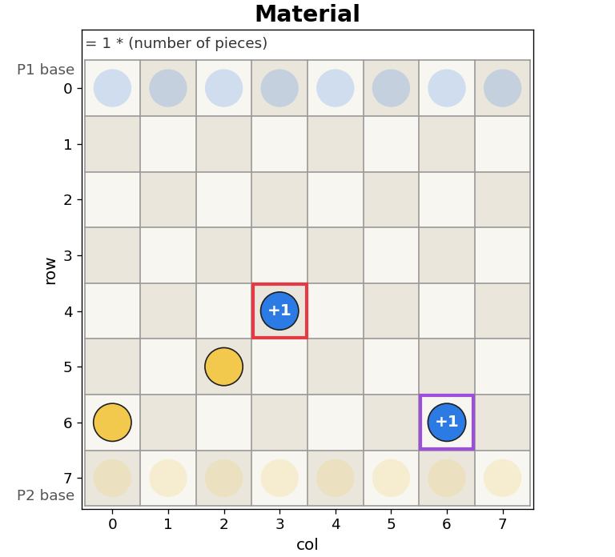

```cpp
class MaterialHeuristic : public Heuristic {
public:
    const char* name() { return "Material"; }
    int estimate(BoardState b) {
        int score = 0;
        for (int r = 0; r < MAX_M; r++) {
            for (int c = 0; c < MAX_N; c++) {
                if (b.grid[r][c] == 1) score++;
                else if (b.grid[r][c] == 2) score--;
            }
        }
        return score;
    }
};
```

### 3.2. Advancement

Pieces that are closer to the opponent's back row are more valuable, as they are closer to winning. The value is the sum of player 1's pieces' distances to his back row minus that of player 2.

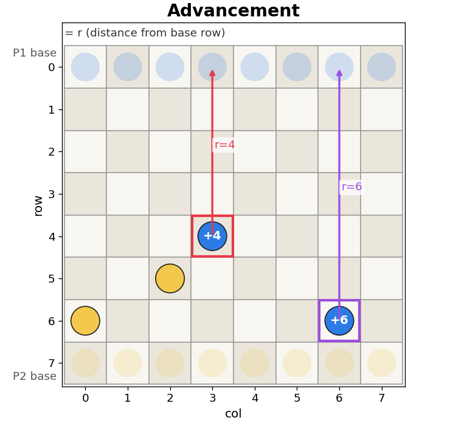

In this example, (4, 3) has a score of 4, (6, 6) has a score of 6.

```cpp
class AdvancementHeuristic : public Heuristic {
public:
    const char* name() { return "Advancement"; }
    int estimate(BoardState b) {
        int score = 0;
        for (int r = 0; r < MAX_M; r++) {
            for (int c = 0; c < MAX_N; c++) {
                if (b.grid[r][c] == 1) score += r;
                else if (b.grid[r][c] == 2) score -= (MAX_M - 1 - r);
            }
        }
        return score;
    }
};
```

### 3.3. Attack

+1 score for each possible move of player 1 that can capture an opponent's piece, that is, has an opponent's piece diagonally in front of it, and vice versa for player 2. This encourages the bot to capture the opponent's pieces and gain material advantage.

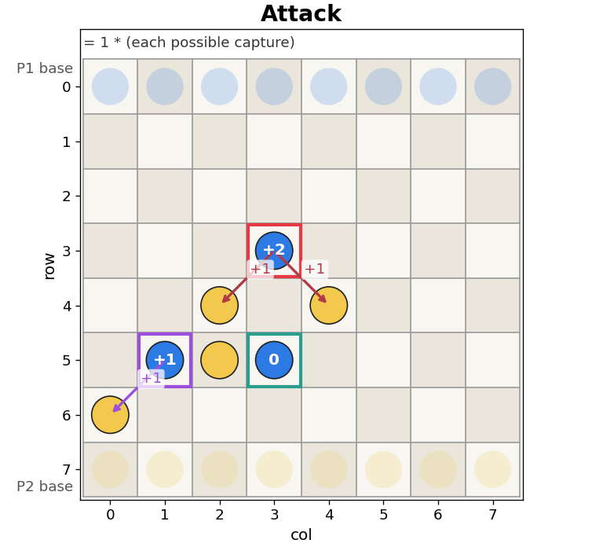

In this example, (3, 3) has a score of 2, as it can capture (4, 2) and (4, 4); (5, 1) has a score of 1 and (5, 3) has a score of 0.

```cpp
class AttackHeuristic : public Heuristic {
public:
    const char* name() { return "Attack"; }
    int estimate(BoardState b) {
        int score = 0;
        for (int r = 0; r < MAX_M; r++) {
            for (int c = 0; c < MAX_N; c++) {
                if (b.grid[r][c] == 1) {
                    if (r + 1 < MAX_M) {
                        if (c > 0 && b.grid[r + 1][c - 1] == 2) score++;
                        if (c < MAX_N - 1 && b.grid[r + 1][c + 1] == 2) score++;
                    }
                } else if (b.grid[r][c] == 2) {
                    if (r - 1 >= 0) {
                        if (c > 0 && b.grid[r - 1][c - 1] == 1) score--;
                        if (c < MAX_N - 1 && b.grid[r - 1][c + 1] == 1) score--;
                    }
                }
            }
        }
        return score;
    }
};
```

### 3.4. Defense

+1 score for each defender of player 1's pieces, that is, has a friendly piece diagonally behind it, and vice versa for player 2.

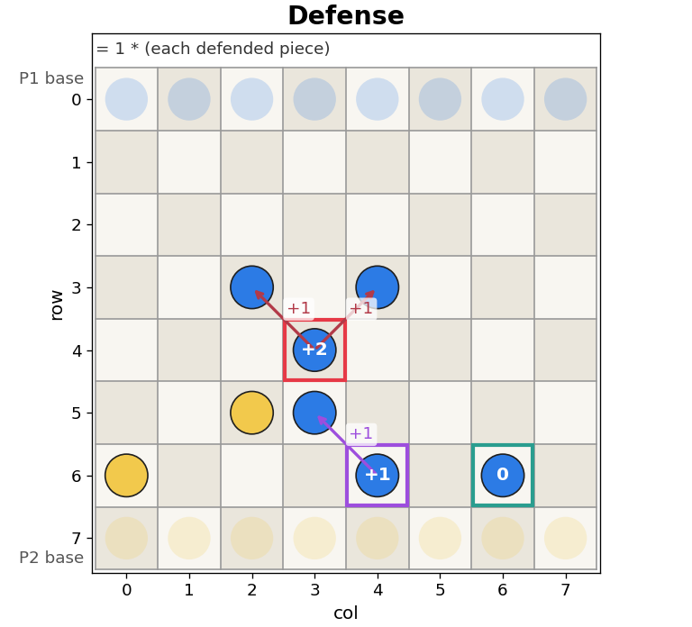

In this example, (4, 3) has a score of 2, as it is defended by (3, 2) and (3, 4); (6, 4) has a score of 1 and (6, 6) has a score of 0.

```cpp
class DefenseHeuristic : public Heuristic {
public:
    const char* name() { return "Defense"; }
    int estimate(BoardState b) {
        int score = 0;
        for (int r = 0; r < MAX_M; r++) {
            for (int c = 0; c < MAX_N; c++) {
                if (b.grid[r][c] == 1) {
                    if (r - 1 >= 0) {
                        if (c > 0 && b.grid[r - 1][c - 1] == 1) score++;
                        if (c < MAX_N - 1 && b.grid[r - 1][c + 1] == 1) score++;
                    }
                } else if (b.grid[r][c] == 2) {
                    if (r + 1 < MAX_M) {
                        if (c > 0 && b.grid[r + 1][c - 1] == 2) score--;
                        if (c < MAX_N - 1 && b.grid[r + 1][c + 1] == 2) score--;
                    }
                }
            }
        }
        return score;
    }
};
```

### 3.5. Aggressive Mixed

This heuristic is a combination of material and advancement, with a bonus for pieces that are on the second-to-last row, as they are one step away from winning. The score for a piece is:

$$S = 100 \text{ (material)} + r^2 \text{ (advancement)} + 500 \cdot \mathbf{1}_{r = 6}$$

where $r$ is the distance to the back row. The bonus encourages the bot to win as soon as possible when it has the chance.

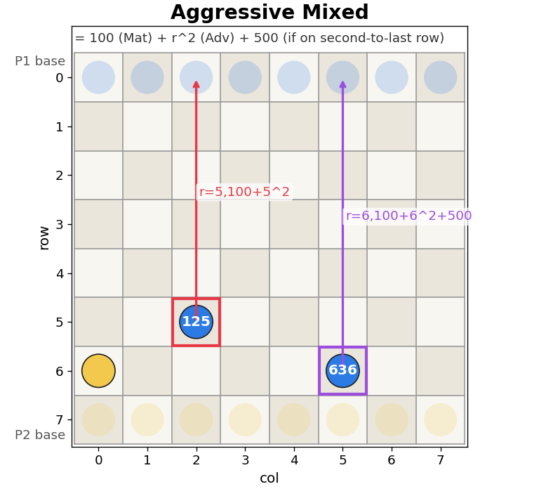

In this example, (5, 2) has a score of $100+5^2=125$ and (6, 6) has a score of $100+6^2+500=636$.

```cpp
class AggresiveMixedHeuristic : public Heuristic {
public:
    const char* name() { return "AggresiveMixed"; }
    int estimate(BoardState b) {
        int score = 0;
        for (int r = 0; r < MAX_M; r++) {
            for (int c = 0; c < MAX_N; c++) {
                if (b.grid[r][c] == 1) {
                    score += 100;
                    score += r * r;
                    if (r >= MAX_M - 2) score += 500;
                } else if (b.grid[r][c] == 2) {
                    score -= 100;
                    score -= (MAX_M - 1 - r) * (MAX_M - 1 - r);
                    if (r <= 1) score -= 500;
                }
            }
        }
        return score;
    }
};
```

### 3.6. Defensive Mixed

This is a combination of material, advancement and defense. The score for a piece is:

$$S = 100 \text{ (material)} + r^2 \text{ (advancement)} + 1 \cdot \text{defenders}$$

where $r$ is the distance to the back row and a piece is considered defended if it has a friendly piece diagonally behind it.

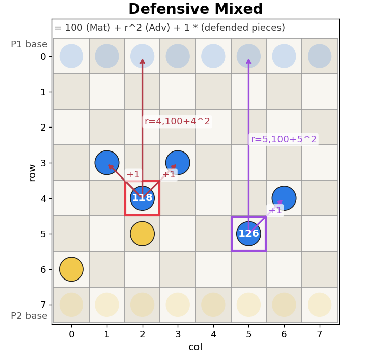

In this example, (4, 2) has a score of $100+4^2+2=118$ (defended by (3, 1) and (3, 3)); and (5, 5) has a score of $100+5^2+1=126$ (defended by (4, 6)).

```cpp
class DefensiveMixedHeuristic : public Heuristic {
public:
    const char* name() { return "DefensiveMixed"; }
    int estimate(BoardState b) {
        int score = 0;
        for (int r = 0; r < MAX_M; r++) {
            for (int c = 0; c < MAX_N; c++) {
                if (b.grid[r][c] == 1) {
                    score += 100;
                    score += r * r;
                    if (r - 1 >= 0) {
                        if (c > 0 && b.grid[r - 1][c - 1] == 1) score++;
                        if (c < MAX_N - 1 && b.grid[r - 1][c + 1] == 1) score++;
                    }
                } else if (b.grid[r][c] == 2) {
                    score -= 100;
                    score -= (MAX_M - 1 - r) * (MAX_M - 1 - r);
                    if (r + 1 < MAX_M) {
                        if (c > 0 && b.grid[r + 1][c - 1] == 2) score--;
                        if (c < MAX_N - 1 && b.grid[r + 1][c + 1] == 2) score--;
                    }
                }
            }
        }
        return score;
    }
};
```

### 3.7. Movability

This heuristic considers the number of possible moves for both players. The score is:

$$S = 100 \cdot (\text{P1 pieces} - \text{P2 pieces}) + 2 \cdot (\text{P1 moves} - \text{P2 moves})$$

This assumes that having more possible moves implies a better position, as it gives more options to choose from.

```cpp
class MovabilityHeuristic : public Heuristic {
public:
    const char* name() { return "Movability"; }
    int estimate(BoardState b) {
        int score = 0;
        for (int r = 0; r < MAX_M; r++) {
            for (int c = 0; c < MAX_N; c++) {
                if (b.grid[r][c] == 1) score++;
                else if (b.grid[r][c] == 2) score--;
            }
        }
        score *= 100;

        vector<Move> p1_moves = get_all_moves(b, 1);
        vector<Move> p2_moves = get_all_moves(b, 2);
        score += (int)p1_moves.size() * 2;
        score -= (int)p2_moves.size() * 2;
        return score;
    }
};
```

## 4. Results and Discussion (1)

To evaluate the performance of these heuristics, we conducted a round-robin tournament where each heuristic played against each other using Alpha-Beta Negamax with a fixed depth of 4 (number of trials for each pair = 20).

We first experimented with Random, Material, Advancement, Attack and Defense heuristics. The results are shown below, where the entry in row $i$ and column $j$ is the number of wins for heuristic $i$ against heuristic $j$:

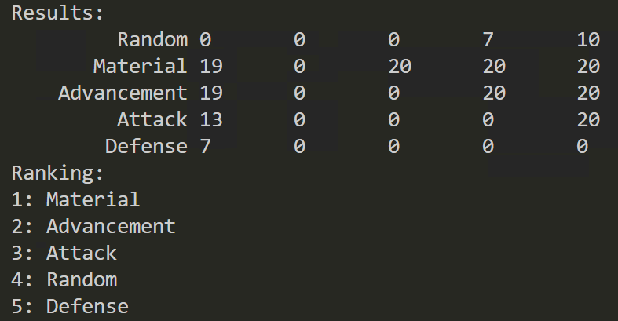

From the results, we can observe that Material outperform all other heuristics, which is a strong takeaway that material advantage is the most important factor in Breakthrough. Therefore, all other heuristics will include material with a high weight (100).

Then we experimented with all of the heuristics in Section 3. The results are shown below:

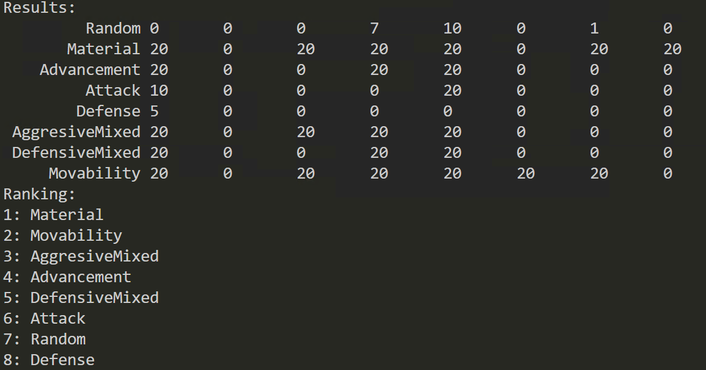

The Material still outperforms all other heuristics. While this further confirms the significance of material advantage, it does not necessarily mean that the other factors are not useful.

In the following experiment, we conducted a tournament with search depth = 6 (number of trials = 10). The results are shown below:

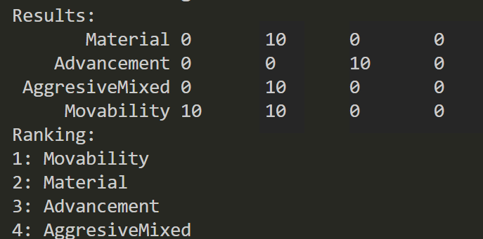

In this experiment, Movability performs much better than Material. This implies that with a deeper search, the bot can better utilize more comprehensive information provided by Movability.

However, the current code is very inefficient, and it takes a much longer time to execute with depth = 6, which makes it difficult to conduct more trials. Therefore, we need to rewrite the code for better optimization, and also consider more advanced search algorithms to further improve the performance of the bot.

## 5. Optimization Techniques

### 5.1. Bitboard Representation

The game is played on a 8x8 board, and there are 2 types of pieces. Therefore, we can represent the board as two 64-bit integers $p_1, p_2$, where the $i$-th bit of $p_1$ is 1 if the $i$-th cell is occupied by player 1, and similarly for $p_2$.

This offers several advantages:

(1) Eliminates the need for nested loops and array manipulation.

(2) Allows for efficient bitwise operations to apply moves and check board states. Their time complexity is reduced from $O(NM)$ to $O(1)$, which significantly improves the performance of the bot.

(3) Reduces memory usage.

For example,

- `__builtin_popcountll` counts the number of 1s in a 64-bit integer, which is the number of pieces for a player.
- To iterate through all pieces of a player, we can use:

```cpp
while (x) {
    int idx = __builtin_ctzll(x); // Get the index of the least significant 1 bit
    x &= (x - 1); // Clear the least significant 1 bit
    int r = idx / MAX_N;
    int c = idx % MAX_N;
    // Process the piece at (r, c)
}
```

This is because `(x - 1)` flips all the bits after the least significant 1 bit, and `x & (x - 1)` makes all bits after the least significant 1 bit to 0, which effectively removes the least significant 1 bit from `x`. In this way we can iterate through all the pieces of a player in $O(P)$ time, where $P$ is the number of pieces for that player, down from $O(NM)$ time.

The implementation of bitboard representation is shown below:

```cpp
struct BitBoard {
    U64 z[2]; // [0=p1, 1=p2]

    BitBoard() {
        z[0] = z[1] = 0ULL;
    }

    BitBoard(U64 p1, U64 p2) : z{p1, p2} {}

    BitBoard(int grid[MAX_M][MAX_N]) {
        z[0] = z[1] = 0ULL;
        for (int8 r = 0; r < MAX_M; r++)
            for (int8 c = 0; c < MAX_N; c++) {
                int8 idx = r * MAX_N + c;
                if (grid[r][c] == 1) z[0] |= (1ULL << idx);
                else if (grid[r][c] == 2) z[1] |= (1ULL << idx);
            }
    }

    inline int get(int8 r, int8 c) const {
        U64 mask = 1ULL << (r * MAX_N + c);
        if (z[0] & mask) return 1;
        if (z[1] & mask) return 2;
        return 0;
    }

    inline void set(int8 r, int8 c, int8 val) {
        U64 mask = 1ULL << (r * MAX_N + c);
        if (val == 1) { z[0] |= mask; z[1] &= ~mask;} 
        else if (val == 2) { z[1] |= mask; z[0] &= ~mask; } 
        else { z[0] &= ~mask; z[1] &= ~mask; }
    }

    inline void clear(int8 r, int8 c) {
        U64 mask = 1ULL << (r * MAX_N + c);
        z[0] &= ~mask;
        z[1] &= ~mask;
    }

    inline U64 get_p(int8 player) const {
        return z[player - 1];
    }
};
```

And the definitions of some helper macros and functions:

```cpp
#define lowbit_id __builtin_ctzll // get lowest 1 bit index
#define popcount __builtin_popcountll // count 1 bits
#define lowbit_pop(x) (x = (x & (x - 1))) // remove lowest 1 bit

inline int8 get_row(int8 idx) {
    return idx / MAX_N;
}

inline int8 get_col(int8 idx) {
    return idx % MAX_N;
}

inline U64 get_bit(int8 r, int8 c) {
    return 1ULL << (r * MAX_N + c);
}

inline U64 col_mask(int8 c) {
    U64 m = 0;
    for (int8 r = 0; r < MAX_M; r++) m |= get_bit(r, c);
    return m;
}
```

It is also much easier to check the winning condition:

```cpp
// return winner (1 or 2), or 0 if no winner
int8 check_win(const BitBoard& b) {
    // any piece reach row M-1 for p1 or row 0 for p2
    if (b.get_p(1) & ROW_MASKS[MAX_M - 1]) return 1;
    if (b.get_p(2) & ROW_MASKS[0]) return 2;
    // or no pieces left for opponent
    if (!b.get_p(1)) return 2;
    if (!b.get_p(2)) return 1;
    return 0;
}
```

where `ROW_MASKS[r]` is a precomputed bitmask with 1 for cells in row `r` and 0 for other cells.

### 5.2. Zobrist Hashing

Zobrist hashing is a technique to efficiently compute a unique hash value for each game state, so that during the search, we can store the evaluated scores of previously visited game states in the transposition table, and avoid redundant calculations.

The initialization of the Zobrist table is shown below. We generate random 64-bit integers for each cell and piece type, which means $2 \cdot NM = 128$ random integers in total for an $8 \times 8$ board. When hashing a game state, we XOR the hash value with the corresponding random key for each piece at its position.

It should also be noted that the same board during P1's turn and P2's turn should be considered different states, as the player to move is different. Therefore, we introduce an additional random key `zobrist_flip` to represent the change of player. When the player changes, we XOR the hash value with `zobrist_flip` to get the new hash value.

```cpp
U64 zobrist_table[MAX_M][MAX_N][3]; // [r][c][0=empty,1=p1,2=p2]
// [0] is not used, just no need to handle index [player-1]
U64 zobrist_flip; // flip side after each move
bool zobrist_init_done = false;
random_device rd;
mt19937_64 global_rng(rd());

void init_zobrist() {
    if (zobrist_init_done) return;
    memset(zobrist_table, 0, sizeof(zobrist_table));
    for (int8 r = 0; r < MAX_M; r++)
        for (int8 c = 0; c < MAX_N; c++)
            for (int8 p = 1; p < 3; p++)
                zobrist_table[r][c][p] = global_rng();
    zobrist_flip = global_rng();
    zobrist_init_done = true;
}

U64 get_hash(const BitBoard& b, int8 player) {
    U64 hash = 0;
    for (int8 r = 0; r < MAX_M; r++)
        for (int8 c = 0; c < MAX_N; c++) {
            hash ^= zobrist_table[r][c][b.get(r, c)];
        }
    if (player == 2) hash ^= zobrist_flip;
    return hash;
}
```

Zobrist hashing allows incremental updates of the hash value when applying a move, which is very efficient.

Specifically, when a piece `sp` moves from `(sr, sc)` to `(dr, dc)`, we need to update the hash value as follows:

1. XOR the hash with `zobrist_table[sr][sc][sp]` to remove the piece from the source cell.
2. XOR the hash with `zobrist_table[dr][dc][dp]` to remove the piece (if any) from the destination cell, where `dp` is the piece at the destination cell before the move. If that cell is empty (`dp=0`), this step does not change the hash value.
3. XOR the hash with `zobrist_table[dr][dc][sp]` to add the piece to the destination cell.
4. XOR the hash with `zobrist_flip` to flip the player.

```cpp
U64 incremental_hash(U64 hash, int8 sr, int8 sc, int8 sp, int8 dr, int8 dc, int8 dp) {
    hash ^= zobrist_table[sr][sc][sp]; // empty source
    hash ^= zobrist_table[dr][dc][dp]; // empty destination
    hash ^= zobrist_table[dr][dc][sp]; // new piece at destination
    hash ^= zobrist_flip; // flip side
    return hash;
}
```

### 5.3. Transposition Table

A transposition table is a hash table that stores previously evaluated game states and their scores, so that when the same game state is encountered again during the search, we can directly return the stored score instead of re-evaluating it.

As we are using Alpha-Beta pruning, we also need to store the type of the score (exact, lower bound or upper bound) to determine how to use the stored score during the search. For example, when considering a beta cut-off, if we find a stored score "at least X" (lower bound) that is already greater than or equal to beta, then pruning is valid.

It should be noted that due to the limited memory size requirement (10000KB), we can only store the last $N$ bits of the hash value in the transposition table, which means there can be collisions. Therefore, when storing an entry in the transposition table, we also store the full hash value, and if an entry with the same lower $N$ bits is found, we overwrite it only if the current search is deeper than the stored entry, or the full hash value matches (which should be very rare).

```cpp
enum TTFlag { EXACT, LOWERBOUND, UPPERBOUND };

struct TTEntry {
    U64 hash;
    int8 depth; // remaining depth when stored, so prefer deeper entries
    TTFlag flag;
    int score;
    Move best_move;
    int8 valid;

    TTEntry() : hash(0), depth(0), flag(EXACT), score(0), valid(0) {}
};

const int TT_SIZE = 1 << 18;
const int TT_MASK = TT_SIZE - 1;
TTEntry tt[TT_SIZE];
// size: (4+1+1+2+5+1) = 14 bytes per entry, * 262144 entries = ~3.6MB

void tt_clear() {
    memset(tt, 0, sizeof(tt));
}

TTEntry* tt_get(U64 hash) {
    TTEntry* e = &tt[hash & TT_MASK];
    if (e->valid && e->hash == hash) return e;
    return nullptr;
}

void tt_update(U64 h, int8 depth, TTFlag flag, int score, Move best_move) {
    TTEntry& e = tt[h & TT_MASK];
    // replace if (1) collision (2) current search is deeper
    if (!e.valid || e.depth <= depth || e.hash == h) {
        e.hash = h;
        e.depth = depth;
        e.flag = flag;
        e.score = score;
        e.best_move = best_move;
        e.valid = 1;
    }
}
```

### 5.4. Move Ordering - Killer Move Heuristic

In Alpha-Beta pruning, we expect to search for best moves first to maximize the chance of pruning. The killer move heuristic [1] is a move ordering technique that memorizes the best moves (killer moves) that caused a beta cut-off at each depth in the search tree. When searching for moves at the same depth, we try the killer moves first.

In the implementation, we store up to 2 killer moves for each depth.

```cpp
const int MAX_DEPTH = 64;
Move killer_moves[MAX_DEPTH][2];

void killer_clear() {
    memset(killer_moves, 0, sizeof(killer_moves));
}

void killer_update(int8 depth, Move mv) {
    if (depth >= MAX_DEPTH) return;
    if (killer_moves[depth][0] == mv) return;
    killer_moves[depth][1] = killer_moves[depth][0];
    killer_moves[depth][0] = mv;
}
```

### 5.5. Alpha-Beta Negamax After Optimization

After applying the above optimization techniques, we can rewrite the Alpha-Beta Negamax algorithm.

The following part is the implementation of move generation with priority given to winning moves, killer moves and best move from transposition table.

```cpp
vector<Move> get_all_moves(const BitBoard& b, int8 player, bool get_any = false, int8 depth = -1, Move* tt_best = nullptr) {
    vector<Move> moves;

    int8 direction = (player == 1) ? 1 : -1;
    int8 opponent = 3 - player;
    int8 goal_row = (player == 1) ? (MAX_M - 1) : 0;

    for (int8 i = 0; i < MAX_M; i++) {
        // starting from pieces closer to opponent side
        int sr = (player == 1) ? (MAX_M - 1 - i) : i;
        int dr = sr + direction;
        if (dr < 0 || dr >= MAX_M) continue;

        U64 row_bits = b.get_p(player) & ROW_MASKS[sr];

        // consider each piece in this row
        while (row_bits) {
            int8 idx = lowbit_id(row_bits);
            lowbit_pop(row_bits);
            int8 sc = idx % MAX_N;

            for (int delta_c = -1; delta_c < 2; delta_c++) {
                int8 dc = sc + delta_c;
                if (dc < 0 || dc >= MAX_N) continue;
                int8 dst_piece = b.get(dr, dc);
                if (delta_c == 0 && dst_piece != 0) continue; // forward blocked
                if (dst_piece == player) continue;

                Move mv(sr, sc, dr, dc);
                int pri = 0;
                if (dr == goal_row) {
                    pri = 500; // winning move
                } else {
                    if (dst_piece == opponent) pri = 100; // capture
                    pri += (player == 1 ? dr : (MAX_M - 1 - dr)); // advancement
                    
                    if (tt_best && mv == *tt_best) pri += 1000; // TT best move
                    if (depth >= 0) {
                        if (mv == killer_moves[depth][0]) pri += 90; // killer move
                        else if (mv == killer_moves[depth][1]) pri += 80;
                    }
                }
                mv.pri = pri;
                moves.push_back(mv);
                if (get_any) return moves;
            }
        }
    }

    sort(moves.begin(), moves.end());
    return moves;
}
```

And the following is the implementation of Alpha-Beta Negamax with transposition table:

```cpp
int abNegamax(const BitBoard& b, U64 hash, int8 depth, int8 maxDepth, int8 player, Heuristic* h, int alpha, int beta) {
    static int node_count = 0;
    if (g_time_limit_ms > 0 && (++node_count & 8191) == 0) { // check every 8192 nodes
        auto now = chrono::steady_clock::now();
        if (chrono::duration<double, milli>(now - g_start_time).count() > g_time_limit_ms) {
            g_time_out = true;
        }
    }
    if (g_time_out) return 0;

    int8 winner = check_win(b);
    if (winner != 0) {
        if (winner == player) return MY_POS_INF + depth;
        else return MY_NEG_INF - depth;
    }
    
    if (depth == maxDepth) {
        return h->evaluate(b, player);
    }

    TTEntry *tt_entry = tt_get(hash);
    Move tt_best_move;
    if (tt_entry && tt_entry->valid) {
        tt_best_move = tt_entry->best_move;
        if (tt_entry->depth >= (maxDepth - depth)) {
            if (tt_entry->flag == EXACT) return tt_entry->score;
            else if (tt_entry->flag == LOWERBOUND && tt_entry->score >= beta) return tt_entry->score;
            else if (tt_entry->flag == UPPERBOUND && tt_entry->score <= alpha) return tt_entry->score;
        }
    }

    vector<Move> moves = get_all_moves(b, player, false, depth, &tt_best_move);
    if (moves.empty()) {
        return MY_NEG_INF - depth; 
    }

    Move best_move = moves[0];
    int best_score = MY_NEG_INF;
    TTFlag flag = UPPERBOUND;

    for (const Move& mv : moves) {
        BitBoard new_b = apply_move(b, mv);
        int8 dst_piece = b.get(mv.dst_r, mv.dst_c);
        U64 new_hash = incremental_hash(hash, mv.src_r, mv.src_c, player, mv.dst_r, mv.dst_c, dst_piece);
        
        int current_alpha = max(alpha, best_score);
        
        int score = -abNegamax(new_b, new_hash, depth + 1, maxDepth, 3 - player, h, -beta, -current_alpha);

        if (g_time_out) return 0;

        if (score > best_score) {
            best_score = score;
            best_move = mv;
            
            if (best_score >= beta) { // beta cutoff
                flag = LOWERBOUND;
                killer_update(depth, mv);
                break; 
            }
        }
    }

    if (!g_time_out) {
        if (best_score > alpha && best_score < beta) {
            flag = EXACT;
        }
        tt_update(hash, maxDepth - depth, flag, best_score, best_move);
    }
    
    return best_score;
}


Move abNegamax_solver(const BitBoard& b, int8 maxDepth, int8 player, Heuristic* h) {
    init_zobrist();
    tt_clear();
    killer_clear();
    
    g_time_out = false;
    g_time_limit_ms = 0; 

    U64 hash = get_hash(b, player);
    vector<Move> moves = get_all_moves(b, player);
    if (moves.empty()) return Move();

    Move best_move = moves[0];
    int alpha = MY_NEG_INF;
    int beta = MY_POS_INF;

    for (const Move& mv : moves) {
        BitBoard new_b = apply_move(b, mv);
        int8 dst_piece = b.get(mv.dst_r, mv.dst_c);
        U64 new_hash = incremental_hash(hash, mv.src_r, mv.src_c, player, mv.dst_r, mv.dst_c, dst_piece);
        int score = -abNegamax(new_b, new_hash, 1, maxDepth, 3 - player, h, -beta, -alpha);
        if (score > alpha) {
            alpha = score;
            best_move = mv;
        }
    }
    return best_move;
}
```

## 6. Advanced Search Frameworks

### 6.1. Iterative Deepening Search (IDS)

One of the issue of Alpha-Beta Negamax is that it requires a fixed search depth, which varies a lot and is hard to tune. Iterative Deepening Search (IDS) solves this by repeatedly running Alpha-Beta Negamax with increasing depth until the time limit is reached.

```cpp
Move iterativeDeepening_solver(const BitBoard& b, int8 maxDepth, int8 player, Heuristic* h, double time_limit_ms = 0) {
    init_zobrist();
    tt_clear(); 
    killer_clear();

    vector<Move> moves = get_all_moves(b, player);
    if (moves.empty()) return Move();
    if (moves.size() == 1) return moves[0];

    g_time_out = false;
    g_start_time = chrono::steady_clock::now();
    g_time_limit_ms = time_limit_ms;

    Move best_move = moves[0];
    U64 hash = get_hash(b, player);

    for (int8 depth = 1; depth <= maxDepth; depth++) {
        int alpha = MY_NEG_INF;
        int beta = MY_POS_INF;
        Move current_best_move_in_depth = best_move;
        int current_best_score = MY_NEG_INF;

        // move best TT to front
        for (int i = 0; i < moves.size(); i++) {
            if (moves[i] == best_move) {
                swap(moves[0], moves[i]);
                break;
            }
        }

        bool complete_depth = true;

        for (const Move& mv : moves) {
            BitBoard new_b = apply_move(b, mv);
            int8 dst_piece = b.get(mv.dst_r, mv.dst_c);
            U64 new_hash = incremental_hash(hash, mv.src_r, mv.src_c, player, mv.dst_r, mv.dst_c, dst_piece);
            
            int score = -abNegamax(new_b, new_hash, 1, depth, 3 - player, h, -beta, -max(alpha, current_best_score));
            
            if (g_time_out) {
                complete_depth = false;
                break;
            }

            if (score > current_best_score) {
                current_best_score = score;
                current_best_move_in_depth = mv;
                
                if (score > alpha) alpha = score;
            }
        }

        if (complete_depth) {
            best_move = current_best_move_in_depth;
            if (current_best_score >= MY_NEAR_INF) break;
        } else {
            break; 
        }
    }
    return best_move;
}
```

### 6.2. Monte Carlo Tree Search (MCTS)

Monte Carlo Tree Search (MCTS) is a search algorithm that uses random sampling of the search space to make decisions. It consists of four steps: selection, expansion, simulation and backpropagation.

1. Selection: Starting from the root node, we recursively select the best child node using UCT until we reach a leaf node.
2. Expansion: If the leaf node is not a terminal (winning) state, we expand it by adding all possible moves as child nodes.
3. Simulation: We perform a random playout from the new child node until we reach a terminal state, and determine the winner.
4. Backpropagation: We update the win/visit counts for all nodes in the path from the new child node to the root node based on the simulation result.

The selection policy, UCT (Upper Confidence Bound for Trees), is defined as:

$$u_i = \frac{w_i}{n_i} + K \sqrt{\frac{\ln N}{n_i}}$$

where $w_i$ and $n_i$ are the win and visit counts for child node $i$, $N$ is the visit count for the parent node, and $K = \sqrt{2}$ is the exploration constant.

MCTS does not require a heuristic evaluation function, and we also experimented with a heuristic-guided playout, where the algorithm has a small probability $1 - \epsilon$ to choose a best move according to the heuristic instead of a random move.

```cpp
struct MCTSNode {
    int8 player;
    int visits;
    int wins;
    BitBoard board;
    Move prev_move;
    MCTSNode* parent;
    vector<MCTSNode*> children;
    vector<Move> to_expand;

    constexpr static double K = 1.414; // exploration constant

    MCTSNode(BitBoard b, int8 p, Move mv, MCTSNode* parent) : player(p), visits(0), wins(0), board(b), prev_move(mv), parent(parent) {
        to_expand = get_all_moves(board, player);
    }

    ~MCTSNode() {
        for (MCTSNode* child : children) {
            delete child;
        }
    }

    bool is_terminal() {
        return check_win(board) != 0;
    }

    bool fully_expanded() {
        return to_expand.empty();
    }

    MCTSNode* expand() {
        int idx = global_rng() % to_expand.size();
        Move mv = to_expand[idx];
        to_expand.erase(to_expand.begin() + idx);

        BitBoard new_b = apply_move(board, mv);
        MCTSNode* child = new MCTSNode(new_b, 3 - player, mv, this);
        children.push_back(child);
        return child;
    }

    MCTSNode* best_child() {
        MCTSNode* best_node = nullptr;
        double best_uct = -1e9;
        double log_visits = log((double)visits);
        for (MCTSNode* child : children) {
            // u_i = w_i / n_i + K * sqrt(log(N) / n_i)
            double uct = (double)child->wins / (child->visits + 1e-9) + K * sqrt(log_visits / (child->visits + 1e-9));
            if (uct > best_uct) {
                best_uct = uct;
                best_node = child;
            }
        }
        return best_node;
    }
};

const int8 MCTS_TRUNCATE = 200;

int8 mcts_heuristic_playout(BitBoard b, int8 player, Heuristic* h = nullptr, double epsilon = 0.7) {
    for (int8 steps = 0; steps < MCTS_TRUNCATE; steps++) {
        int8 winner = check_win(b);
        if (winner != 0) return winner;

        vector<Move> moves = get_all_moves(b, player);
        if (moves.empty()) return 3 - player;

        Move mv;
        if (h == nullptr || (double)global_rng() / global_rng.max() < epsilon) { // random move
            mv = moves[global_rng() % moves.size()];
        } else { // heuristic move
            int best_score = MY_NEG_INF;
            for (const Move& m : moves) {
                BitBoard new_b = apply_move(b, m);
                int score = h->evaluate(new_b, player);
                if (score > best_score) {
                    best_score = score;
                    mv = m;
                }
            }
        }
        b = apply_move(b, mv);
        player = 3 - player;
    }
    // if truncated, decide winner by material
    int8 p1_count = popcount(b.get_p(1));
    int8 p2_count = popcount(b.get_p(2));
    return (p1_count >= p2_count) ? 1 : 2;
}

Move mcts_solver(const BitBoard& b, int8 player, Heuristic* h = nullptr, int max_iters = 100000, double time_limit_ms = 0) {
    MCTSNode * root = new MCTSNode(b, player, Move(), nullptr);

    auto start_time = chrono::steady_clock::now();

    for (int iter = 0; iter < max_iters; iter++) {
        // Selection
        MCTSNode* node = root;
        while (!node->is_terminal() && node->fully_expanded()) {
            node = node->best_child();
        }

        // Expansion
        if (!node->is_terminal() && !node->fully_expanded()) {
            node = node->expand();
        }

        // Simulation
        int8 winner = mcts_heuristic_playout(node->board, node->player, h);

        // Backpropagation
        MCTSNode* back_node = node;
        while (back_node) {
            back_node->visits++;
            if (back_node->player != winner) {
                back_node->wins++; // win is counted for the parent player, which is the opposite of the current player
            }
            back_node = back_node->parent;
        }

        if (time_limit_ms > 0 && iter > 0 && (iter & 127) == 0) { // check time every 128 iters
            auto now = chrono::steady_clock::now();
            double elapsed = chrono::duration<double, milli>(now - start_time).count();
            if (elapsed > time_limit_ms) break;
        }
    }

    MCTSNode* best_child = nullptr;
    int best_visits = -1;
    for (MCTSNode* child : root->children) {
        if (child->visits > best_visits) {
            best_visits = child->visits;
            best_child = child;
        }
    }
    Move best_move = best_child ? best_child->prev_move : get_all_moves(b, player, true)[0];
    delete root; // will recursively delete all nodes
    return best_move;
}
```

## 7. Heuristic Evaluation Function (2)

With bitboard representation, the abovementioned heuristics can be implemented more efficiently. For example, the material heuristic can be implemented simply with `popcount`:

```cpp
class MaterialHeuristic : public Heuristic {
public:
    const char* name() { return "Material"; }
    int estimate(const BitBoard& b) {
        return popcount(b.get_p(1)) - popcount(b.get_p(2));
    }
};
```

And the advancement heuristic can be implemented by iterating through all pieces of both players and summing up their distance to the back row:

```cpp
class AdvancementHeuristic : public Heuristic {
public:
    const char* name() { return "Advancement"; }
    int estimate(const BitBoard& b) {
        int score = 0;
        U64 tmp = b.get_p(1);
        while (tmp) {
            int8 idx = lowbit_id(tmp);
            lowbit_pop(tmp);
            score += get_row(idx);
        }
        tmp = b.get_p(2);
        while (tmp) {
            int8 idx = lowbit_id(tmp);
            lowbit_pop(tmp);
            score -= (MAX_M - 1 - get_row(idx));
        }
        return score;
    }
};
```

But more importantly, we can also design more complex heuristics.

### 7.1. Movable Material

The score for a piece is:

$$S = 100 \text{ (material)} + 2 \cdot \text{valid moves}$$

Where valid moves are calculated by checking straight moves if they are not blocked, and diagonal moves if they are not occupied by friendly pieces. This heuristic is a simpler estimation of movability, which should be more efficient to compute than listing all possible moves for both players.

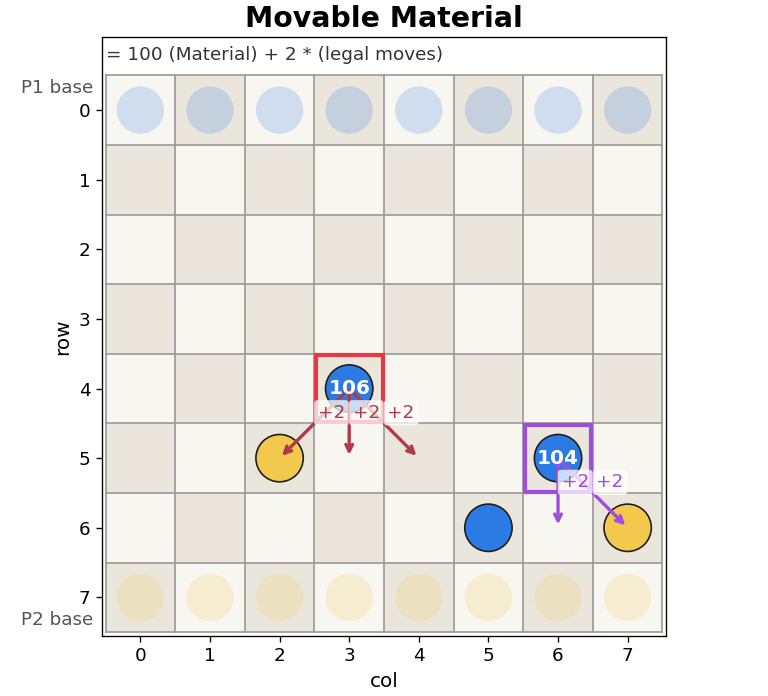

In this example, (4, 3) has a score of 106 because it can move in all 3 directions; (5, 6) has a score of 104 because it can only move straight and diagonally left, as (6, 5) is occupied by a friendly piece.

```cpp
const U64 DL_MASK = ~0x0101010101010101ULL; // col 0 pawns can't move diagonally left
const U64 DR_MASK = ~0x8080808080808080ULL; // col 7 pawns can't move diagonally right

class MovableMaterialHeuristic : public Heuristic {
public:
    const char* name() { return "MovableMaterial"; }
    int estimate(const BitBoard& b) {
        U64 p1 = b.get_p(1), p2 = b.get_p(2);
        int score = popcount(p1) - popcount(p2);
        score *= 100;
        U64 all = p1 | p2;
        // assume all p1 pieces can move forward
        // straight << 8, diagonal left << 7, diagonal right << 9
        U64 p1_st = (p1 << MAX_N) & ~all;
        U64 p1_dl = ((p1 & DL_MASK) << (MAX_N - 1)) & ~p1;
        U64 p1_dr = ((p1 & DR_MASK) << (MAX_N + 1)) & ~p1;
        score += popcount(p1_st | p1_dl | p1_dr) * 2;

        // for p2
        // straight >> 8, diagonal left >> 9, diagonal right >> 7
        U64 p2_st = (p2 >> MAX_N) & ~all;
        U64 p2_dl = ((p2 & DL_MASK) >> (MAX_N + 1)) & ~p2;
        U64 p2_dr = ((p2 & DR_MASK) >> (MAX_N - 1)) & ~p2;
        score -= popcount(p2_st | p2_dl | p2_dr) * 2;
        return score;
    }
};
```

The visualization of the bitwise operations for P1 pieces is shown below:

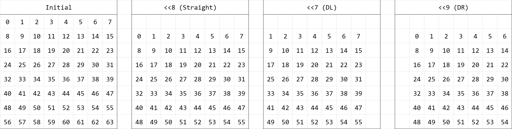

- Going straight: left shift by 8 (<< MAX_N), and check if the destination cell is empty by bitwise AND with `~all`.
- Going diagonally left: block pieces in column 0 with `~DL_MASK`, left shift by 7 (<< (MAX_N - 1)), and check if the destination cell is not occupied by friendly pieces with `~p1`.
- Going diagonally right: block pieces in column 7 with `~DR_MASK`, left shift by 9 (<< (MAX_N + 1)), and check if the destination cell is not occupied by friendly pieces with `~p1`.

Similarly for P2 pieces, but with right shifts.

### 7.2. Central Control

This heuristic encourages pieces to stay in central columns, as they have more mobility and are harder to block. The score for a piece is:

$$S = 100 \text{ (material)} + r^2 \text{ (advancement)} + w_c \cdot 10 \text{ (central control)}$$

Where $r$ is the row index, and $w_c = \{0, 1, 2, 3, 3, 2, 1, 0\}$ is the weight for central control based on the column index. Pieces at column 3 and 4 get the highest central control bonus.

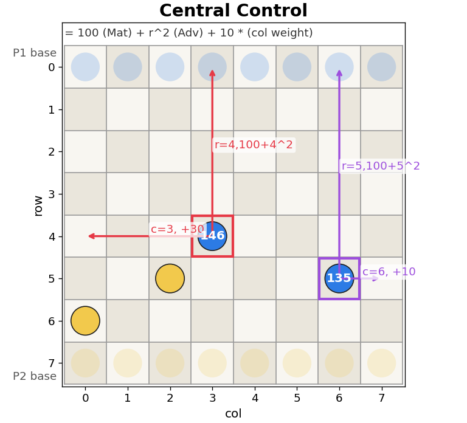

In this example, (4, 3) has a score of $100 + 4^2 + 3 \cdot 10 = 146$; (5, 6) has a score of $100 + 5^2 + 1 \cdot 10 = 135$.

```cpp
class CentralControlHeuristic : public Heuristic {
private:
    static const int8 ctr_col_weight[MAX_N];
public:
    const char* name() { return "CentralControl"; }
    int estimate(const BitBoard& b) {
        int score = 0;
        U64 tmp = b.get_p(1);
        while (tmp) {
            int8 idx = lowbit_id(tmp);
            lowbit_pop(tmp);
            int8 r = get_row(idx), c = get_col(idx);
            score += 100 + MY_SQ[r] + ctr_col_weight[c] * 10;
        }
        tmp = b.get_p(2);
        while (tmp) {
            int8 idx = lowbit_id(tmp);
            lowbit_pop(tmp);
            int8 r = get_row(idx), c = get_col(idx);
            score -= 100 + MY_SQ[MAX_M - 1 - r] + ctr_col_weight[c] * 10;
        }
        return score;
    }
};

const int8 CentralControlHeuristic::ctr_col_weight[MAX_N] = {0, 1, 2, 3, 3, 2, 1, 0};
// MY_SQ is a precomputed array of squares up to MAX_M,  = {0, 1, 4, 9, 16, 25, 36, 49}
```

### 7.3. Safe Advancement

Safe Advancement considers the material, advancement and also the safety of pieces. The penalty for a piece is:

$$P = \begin{cases}-30 & \text{if threatened and not protected} \\ -5 & \text{if threatened but protected} \\ 0 & \text{otherwise}\end{cases}$$

Where a piece is threatened if it can be captured by an opponent piece in the next turn (diagonally forward), and it is protected if there is a friendly piece that can capture the threatening opponent piece in the next turn (diagonally backward).

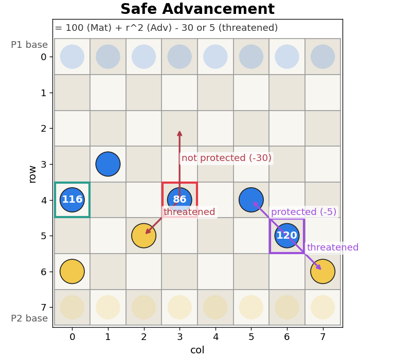

In the above example,

- (4, 3) has a score of $100 + 4^2 - 30 = 86$ because it is threatened by (5, 2) and not protected by any friendly piece.
- (5, 6) has a score of $100 + 5^2 - 5 = 120$ because it is threatened by (6, 7) but protected by (4, 5).
- (4, 0) has a score of $100 + 4^2 = 116$ because it is not threatened.

```cpp
class SafeAdvancementHeuristic : public Heuristic {
public:
    const char* name() { return "SafeAdvancement"; }
    int estimate(const BitBoard& b) {
        int score = 0;
        U64 p1 = b.get_p(1), p2 = b.get_p(2);
        U64 tmp = p1;
        while (tmp) {
            int8 idx = lowbit_id(tmp);
            lowbit_pop(tmp);
            int8 r = get_row(idx), c = get_col(idx);
            bool threat = false, protect = false;
            if (r - 1 >= 0) {
                if (c > 0 && (p1 & get_bit(r - 1, c - 1))) protect = true;
                if (c < MAX_N - 1 && (p1 & get_bit(r - 1, c + 1))) protect = true;
            }
            if (r < MAX_M - 1) {
                if (c > 0 && (p2 & get_bit(r + 1, c - 1))) threat = true;
                if (c < MAX_N - 1 && (p2 & get_bit(r + 1, c + 1))) threat = true;
            }
            score += 100 + MY_SQ[r];
            if (threat && !protect) score -= 30;
            else if (threat && protect) score -= 5;
        }
        tmp = p2;
        while (tmp) {
            int8 idx = lowbit_id(tmp);
            lowbit_pop(tmp);
            int8 r = get_row(idx), c = get_col(idx);
            bool threat = false, protect = false;
            if (r < MAX_M - 1) {
                if (c > 0 && (p2 & get_bit(r + 1, c - 1))) protect = true;
                if (c < MAX_N - 1 && (p2 & get_bit(r + 1, c + 1))) protect = true;
            }
            if (r - 1 >= 0) {
                if (c > 0 && (p1 & get_bit(r - 1, c - 1))) threat = true;
                if (c < MAX_N - 1 && (p1 & get_bit(r - 1, c + 1))) threat = true;
            }
            score -= 100 + MY_SQ[MAX_M - 1 - r];
            if (threat && !protect) score += 30;
            else if (threat && protect) score += 5;
        }
        return score;
    }
};
```

## 8. Results and Discussion (2)

We first repeated the experiments for Alpha-Beta Negamax. Using AB4 (Alpha-Beta Negamax with depth 4) with all heuristics, and AB6-Material, AB8-Material, the results are shown below:

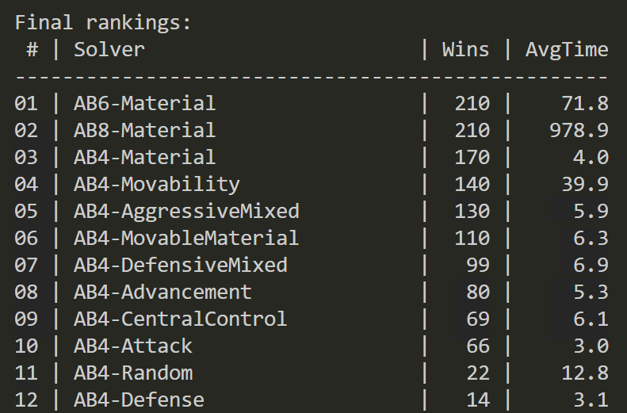

It can be observed that while AB4-Material is stronger than any other AB4 algorithm, it is still much weaker than AB6-Material and AB8-Material, which indicates that the search depth does improve the performance. Additionally, the time consumption of AB4 algorithms have reduced significantly from 1000+ms to around 10ms, which is a huge improvement.

Next, we compared the performance of IDS and MCTS, with AB6-Material as the baseline (time limit 1500ms):

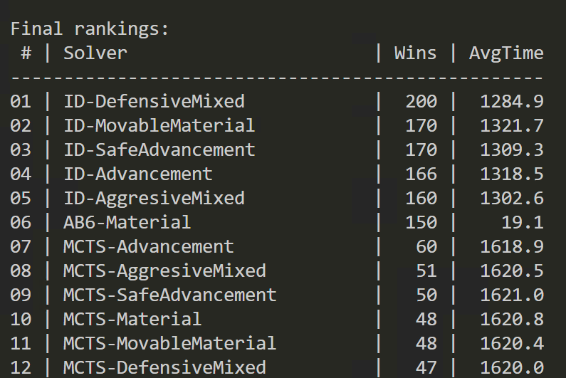

IDS outperform AB6-Material, while MCTS performs much worse than AB6-Material. This suggests that in Breakthrough, a game with easily evaluated heuristics and a relatively small branching factor, MCTS may not be as effective as traditional search algorithms like IDS under a limited time budget. 

Therefore, the following optimizations will be based on IDS.

The following experiment evaluates the performance of IDS with different heuristics:

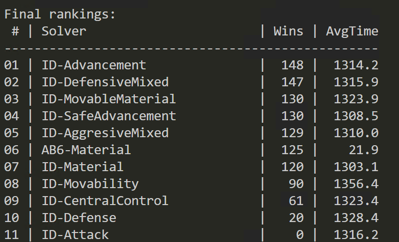

Several heuristics stand out: Advancement, Defensive Mixed, Safe Advancement and Movable Material. Specifically, Defensive Mixed has the most stable performance over all opponents.

## 9. Random Search, Ablation and Final Model

### 9.1. Random Search for Best Heuristic Weights

Although ID-DefensiveMixed is the best single model discovered in the experiements, it should be noted that the performance rely of all heuristics rely heavily on the specific weights used in the evaluation function. We have already known that Material is strong and solid, but how much weight should be put on other components is hard to tune. Since in the last section, we have found several promising heuristics: Defensive Mixed, Safe Advancement and Movable Material, we can try to combine them together, and use a random search to find the best weights for each component.

It defines six weights for the components:

- `wm`: material (fixed at 1000)
- `wa`: advancement (multiplied by $r^2$)
- `wmv`: movable material
- `wp`: protected
- `wt`: threaten (negative score)
- `wtp`: threaten but protected (negative score)

```cpp
class DynamicWeightedHeuristic : public Heuristic {
public:
    int w_material;
    int w_advancement;
    int w_movable;
    int w_protect;
    int w_threat;
    int w_threat_and_protect;
    DynamicWeightedHeuristic(int wm=1000, int wa=10, int wmv=20, int wp=30, int wt=200, int wtp=30)
        : w_material(wm), w_advancement(wa), w_movable(wmv), w_protect(wp), w_threat(wt), w_threat_and_protect(wtp) {}
    
    const char* name() {
        char* buf = new char[64];
        sprintf(buf, "DW-%d-%d-%d-%d-%d-%d", w_material, w_advancement, w_movable, w_protect, w_threat, w_threat_and_protect);
        return buf;
    }

    int estimate(const BitBoard& b) {
        int score = 0;
        U64 p1 = b.get_p(1), p2 = b.get_p(2);
        U64 tmp = p1;
        while (tmp) {
            int8 idx = lowbit_id(tmp);
            lowbit_pop(tmp);
            int8 r = get_row(idx), c = get_col(idx);
            bool threat = false, protect = false;
            if (r - 1 >= 0) {
                if (c > 0 && (p1 & get_bit(r - 1, c - 1))) protect = true;
                if (c < MAX_N - 1 && (p1 & get_bit(r - 1, c + 1))) protect = true;
            }
            if (r < MAX_M - 1) {
                if (c > 0 && (p2 & get_bit(r + 1, c - 1))) threat = true;
                if (c < MAX_N - 1 && (p2 & get_bit(r + 1, c + 1))) threat = true;
            }
            score += w_material;
            score += w_advancement * MY_SQ[r];
            if (threat && !protect) score -= w_threat;
            else if (threat && protect) score -= w_threat_and_protect;
            else if (!threat && protect) score += w_protect;
        }
        tmp = p2;
        while (tmp) {
            int8 idx = lowbit_id(tmp);
            lowbit_pop(tmp);
            int8 r = get_row(idx), c = get_col(idx);
            bool threat = false, protect = false;
            if (r < MAX_M - 1) {
                if (c > 0 && (p2 & get_bit(r + 1, c - 1))) protect = true;
                if (c < MAX_N - 1 && (p2 & get_bit(r + 1, c + 1))) protect = true;
            }
            if (r - 1 >= 0) {
                if (c > 0 && (p1 & get_bit(r - 1, c - 1))) threat = true;
                if (c < MAX_N - 1 && (p1 & get_bit(r - 1, c + 1))) threat = true;
            }
            score -= w_material;
            score -= w_advancement * MY_SQ[MAX_M - 1 - r];
            if (threat && !protect) score += w_threat;
            else if (threat && protect) score += w_threat_and_protect;
            else if (!threat && protect) score -= w_protect;
        }
        U64 all = p1 | p2;
        U64 p1_st = (p1 << MAX_N) & ~all;
        U64 p1_dl = ((p1 & DL_MASK) << (MAX_N - 1)) & ~p1;
        U64 p1_dr = ((p1 & DR_MASK) << (MAX_N + 1)) & ~p1;
        score += w_movable * popcount(p1_st | p1_dl | p1_dr);
        U64 p2_st = (p2 >> MAX_N) & ~all;
        U64 p2_dl = ((p2 & DL_MASK) >> (MAX_N + 1)) & ~p2;
        U64 p2_dr = ((p2 & DR_MASK) >> (MAX_N - 1)) & ~p2;
        score -= w_movable * popcount(p2_st | p2_dl | p2_dr);
        return score;
    }
};
```

And use a random search to find the best weights. To evaluate the performance of each candidate, we play it against their components (Material, Defensive Mixed, Movable Material and Safe Advancement), and sort candidates by total wins.

```cpp
void random_search(int n_strategies, int trials) {
    // randomly search for best parameters for DynamicWeightedHeuristic
    vector<SolverProfile> opponents = {
        {"Material", AB, new MaterialHeuristic(), 6, 0, 0},
        {"DefensiveMixed", ID, new DefensiveMixedHeuristic(), 100, 0, 1500},
        {"MovableMaterial", ID, new MovableMaterialHeuristic(), 100, 0, 1500},
        {"SafeAdvancement", ID, new SafeAdvancementHeuristic(), 100, 0, 1500}
    };
    vector<SolverProfile> candidates;
    for (int i = 0; i < n_strategies; i++) {
        // base (1000, 10, 20, 30, 200, 30)
        int wm = 1000;
        int wa = global_rng() % 40;
        int wmv = global_rng() % 60;
        int wp = global_rng() % 80;
        int wt = global_rng() % 300;
        int wtp = global_rng() % 100;
        Heuristic* h = new DynamicWeightedHeuristic(wm, wa, wmv, wp, wt, wtp);
        candidates.push_back({h->name(), ID, h, 100, 0, 1500});
    }

    FILE* output_csv = fopen("random_search_summary.csv", "w");
    fprintf(output_csv, "Candidate,Material,DefensiveMixed,MovableMaterial,SafeAdvancement,TotalWins\n");
    vector<vector<int>> results(candidates.size(), vector<int>(opponents.size(), 0));
    for (int i = 0; i < candidates.size(); i++) {
        for (int j = 0; j < opponents.size(); j++) {
            int p1_wins = 0, p2_wins = 0;
            for (int t = 0; t < trials; t++) {
                MatchResult res = play(candidates[i], opponents[j], 100);
                if (res.winner == 1) p1_wins++;
                else p2_wins++;
            }
            results[i][j] = p1_wins;
            printf("Candidate %s vs Opponent %s: %d/%d\n", candidates[i].name, opponents[j].name, p1_wins, trials);
        }
    }
    // sort by total wins
    vector<pair<int, int>> candidate_wins; // (wins, index)
    for (int i = 0; i < candidates.size(); i++) {
        int total_wins = 0;
        for (int j = 0; j < opponents.size(); j++) {
            total_wins += results[i][j];
        }
        candidate_wins.push_back({total_wins, i});
    }
    sort(candidate_wins.rbegin(), candidate_wins.rend()); // win descending

    for (const auto& [total_wins, idx] : candidate_wins) {
        fprintf(output_csv, "%s", candidates[idx].name);
        for (int j = 0; j < opponents.size(); j++) {
            fprintf(output_csv, ",%d", results[idx][j]);
        }
        fprintf(output_csv, ",%d\n", total_wins);
    }
    fclose(output_csv);
}
```

After a random search with 60 candidates and 20 trials each, we found 5 most promising candidates. To increase the confidence of the result, we further conducted a tournament among these candidates and baseline heuristics, and the results are shown below:

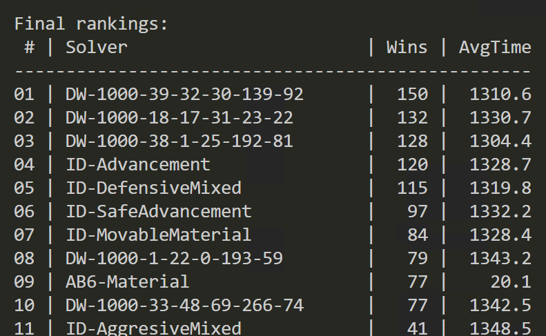

The best model is `DW-1000-39-32-30-139-92`. 

### 9.2. Ablation Analysis

With ablation analysis, we can have a better understanding of the importance of each component in the heuristic. Taking the best candidate `DW-1000-39-32-30-139-92` as the baseline, we can set each weight to 0 while keeping other weights unchanged. The results are shown below:

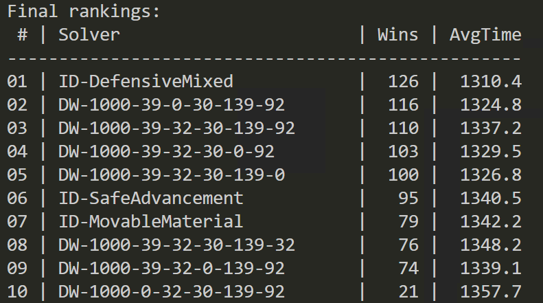

`DW-1000-39-0-30-139-92` (without movable material) outperforms all other ablation models, which suggests that the movable material component is not as important as other components. On the other hand, `DW-1000-0-32-30-139-92` (without advancement) has the worst performance, which indicates that advancement is highly important.

Considering the significance of advancement, we tried with several more mutations of the weights. The results are shown below:

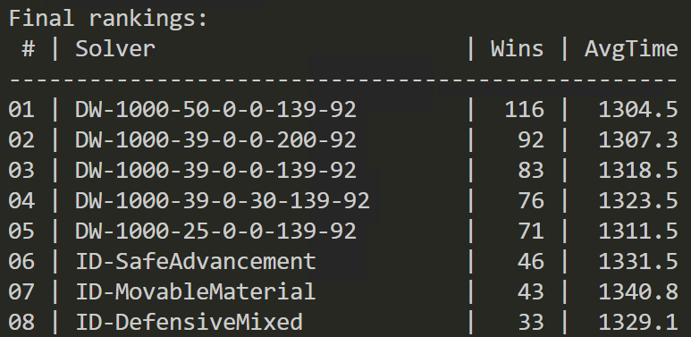

`DW-1000-50-0-0-139-92` performs the best. This is our final model, with only material, advancement and threaten penalities, displaying higher stability than the full model.

The process of this section is summarized in the image below.

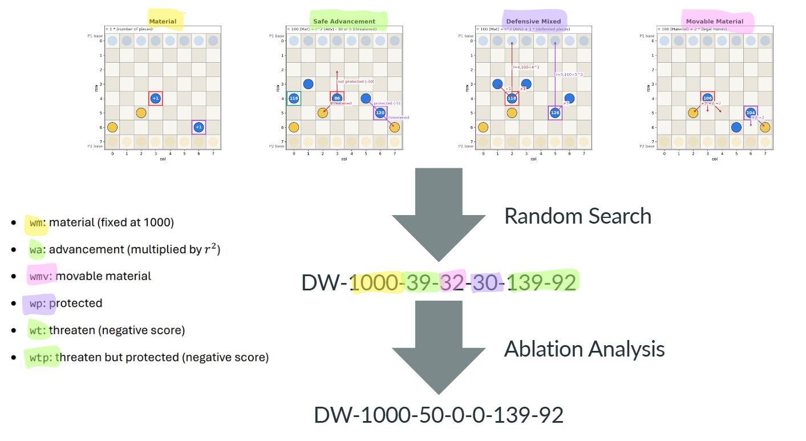

## 10. Conclusion

Our final approach is an Iterative Deepening Search with a combined heuristic of material, advancement and safety, which achieves a strong performance against all baselines, AIs and human players.

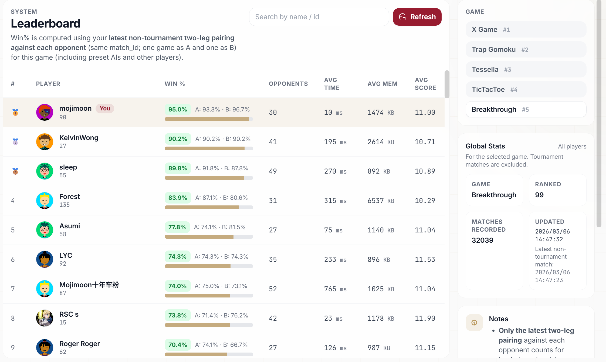

The main limitation of our approach includes: due to the limited computing resource, we are not able to examine more candidates, and given the large space of parameters, it is possible that there are better candidates that we have not discovered. In addition, we have not tried MCTS with implicit minimax backups [2] or mixing MCTS with Alpha-Beta Negamax in a hybrid search framework [3], which has been shown to be promising according to recent research.

This project demonstrates the importance of both search algorithms and heuristic design in game AI. With a well-calibrated heuristic, even a simple search algorithm can achieve a strong performance. On the other hand, with a powerful search algorithm, we can further enhance the performance by exploring effectively and efficiently in the search space. Additionally, this project also illustrates the process of systematically designing, evaluating and optimizing a game AI, which is a valuable skill in any field of software, game or AI development.

## Appendix A. Source Code

The full code can be found at the Google Drive link:

https://drive.google.com/drive/folders/1W0cxX3s21vLR8rH-cHrFHHdHF6j-F4fz?usp=sharing

where v1.cpp is the implementation up to Section 4 (only Alpha-Beta Negamax, no optimizations), and main.cpp is the final implementation.

## References and Acknowledgements

[1] Peter Henderson. 1999. Killer Heuristic. In Encyclopedia of Algorithms, Ming-Yang Kao (Ed.). Springer, Boston, MA, 437–438. https://doi.org/10.1007/978-1-4615-0163-9_437

All of the code is implemented by myself. I only referred to the textbook and lecture notes for search algorithms, and the rest of the code is completely original.
